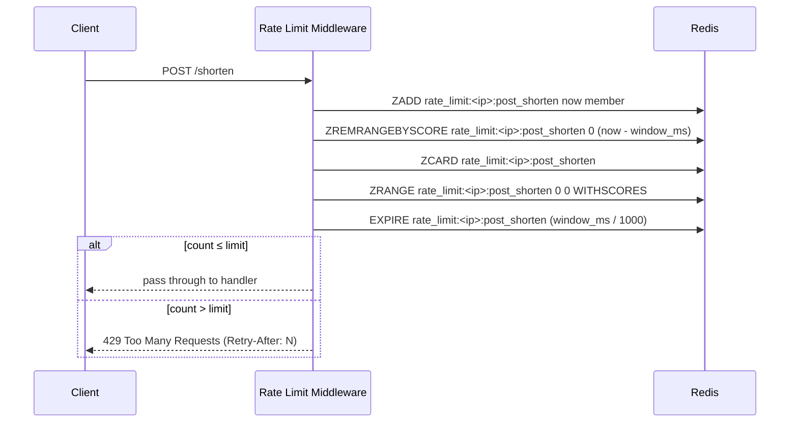

# Post 3 Draft — Rate Limiting

> *I used AI to scaffold the implementation. All measurements, configuration decisions, and failure observations are from running this on a real VPS.*

---

**Title:** *How I rate limited my URL shortener — and why the algorithm choice matters more than you'd think*

**TL;DR:**
<!-- YOUR WORDS: 2-3 sentences. Something like: "Before writing any rate limiting code, you have to choose an algorithm.
     Fixed window is simple but has a well-known exploit. Sliding window eliminates it at modest cost.
     For abuse prevention on POST /shorten, sliding window was the right call — and Redis makes the implementation clean." -->

---

**Who this is for:** This post assumes you've followed the series or are running a Hono app with Redis available. No prior knowledge of rate limiting algorithms required — that is what this post covers.

*No new dependencies in this phase. Redis is already running from Phase 2.*

---

**Intro hook:**
"Add rate limiting" sounds like a one-liner. It isn't. Before you write any code, you have to choose an algorithm — and the choice has real consequences for user experience, fairness, and exploitability.

---

## The Three Algorithms

Rate limiting algorithms differ in how they define "too many requests in a time window." The differences matter.

### Fixed Window

The simplest approach: count requests per IP in a time bucket, reset the counter at the start of each new bucket.

```
minute 0 [00:00 - 00:59]  → 8 requests  → allowed (limit: 10)
minute 1 [01:00 - 01:59]  → 8 requests  → allowed
```

Redis implementation is two operations: `INCR key` and `EXPIRE key window_seconds`.

**The problem:** the window boundary is exploitable.

```
00:59 → 10 requests   (limit reached for minute 0)
01:00 → 10 requests   (new minute, counter resets)
```

That's 20 requests in 2 seconds — double the stated limit. Anyone who understands how your rate limiter works can exploit this by timing requests around the boundary. It's not a theoretical edge case; it's a known, documented exploit.

### Sliding Window

Sliding window fixes the boundary exploit by counting requests relative to *now*, not relative to a fixed clock boundary.

Instead of "how many requests in the current minute," it asks "how many requests in the last 60 seconds from this moment."

```
now = 01:30
window = 60s
→ count requests between 00:30 and 01:30
→ the boundary is always moving — there's no single reset moment to exploit
```

Redis implementation uses a sorted set: timestamps as both the score and the member value. On each request:
1. Add current timestamp to the set
2. Remove entries older than `now - window`
3. Count what remains
4. If count > limit, reject

Slightly more memory and CPU than fixed window — each IP has a sorted set of timestamps rather than a single counter. At the scale of this project, that cost is negligible.

### Token Bucket

Tokens accumulate at a steady rate (e.g., 1 token per second, max bucket size 10). Each request consumes one token. Requests are rejected when the bucket is empty.

Token bucket **allows bursts**: if you haven't made requests in 5 seconds, you accumulate 5 tokens and can make 5 requests back-to-back. This is good for APIs where legitimate users have bursty-but-normal traffic patterns.

It's harder to implement correctly without race conditions — you need to track both the token count and the last refill timestamp, atomically.

<!-- YOUR WORDS: Did you consider token bucket? Why did you rule it out for this use case?
     The key distinction: POST /shorten is an abuse prevention target, not a burst-tolerant API.
     A legitimate user shouldn't need to create 10 URLs in a second. -->

---

## Why Sliding Window for This App

The `POST /shorten` endpoint is a spam target. The goal is abuse prevention, not graceful burst tolerance.

Sliding window matches this goal:
- No exploitable boundary
- Predictable, auditable behavior ("you made N requests in the last 60 seconds")
- Clean Redis implementation



---

## The Implementation

```typescript
// src/middleware/rateLimit.ts
import { createMiddleware } from 'hono/factory'
import { HTTPException } from 'hono/http-exception'
import { redis } from '../lib/redis'

const RATE_LIMIT_MAX = Number(process.env.RATE_LIMIT_MAX ?? 10)
const RATE_LIMIT_WINDOW_MS = Number(process.env.RATE_LIMIT_WINDOW_MS ?? 60_000)

export const rateLimit = createMiddleware(async (c, next) => {
  // Caddy forwards the original client IP via X-Forwarded-For
  const forwarded = c.req.header('x-forwarded-for')
  const ip = forwarded?.split(',')[0]?.trim() ?? 'unknown'
  const key = `rate_limit:${ip}:post_shorten`
  const now = Date.now()
  const windowStart = now - RATE_LIMIT_WINDOW_MS

  try {
    const pipeline = redis.pipeline()

    // 1. Add current request timestamp (with random suffix to guarantee uniqueness)
    pipeline.zadd(key, now, `${now}-${Math.random().toString(36).slice(2)}`)

    // 2. Remove entries outside the sliding window
    pipeline.zremrangebyscore(key, 0, windowStart)

    // 3. Count remaining entries in the window
    pipeline.zcard(key)

    // 4. Get the oldest remaining entry to compute Retry-After
    pipeline.zrange(key, 0, 0, 'WITHSCORES')

    // 5. Set expiry on the key so Redis cleans it up eventually
    pipeline.expire(key, Math.ceil(RATE_LIMIT_WINDOW_MS / 1000))

    const results = await pipeline.exec()
    if (!results) {
      console.error({ msg: 'Rate limit pipeline returned no results', ip })
      return next()
    }

    const countResult = results[2] // zcard
    if (!countResult || countResult[0]) {
      console.error({ msg: 'Rate limit zcard failed', err: countResult?.[0], ip })
      return next()
    }

    const count = countResult[1] as number

    if (count > RATE_LIMIT_MAX) {
      const oldestResult = results[3] // zrange withscores
      let retryAfter = Math.ceil(RATE_LIMIT_WINDOW_MS / 1000)

      if (oldestResult && !oldestResult[0]) {
        const oldestEntry = oldestResult[1] as string[]
        if (oldestEntry.length >= 2) {
          const oldestTimestamp = Number(oldestEntry[1])
          retryAfter = Math.max(
            1,
            Math.ceil((oldestTimestamp + RATE_LIMIT_WINDOW_MS - now) / 1000)
          )
        }
      }

      throw new HTTPException(429, {
        message: 'Too Many Requests',
        res: new Response(
          JSON.stringify({ error: 'Too Many Requests' }),
          {
            status: 429,
            headers: {
              'Content-Type': 'application/json',
              'Retry-After': String(retryAfter),
            },
          }
        ),
      })
    }

    return next()
  } catch (err) {
    if (err instanceof HTTPException) {
      throw err
    }

    // Redis is likely down — fail open so the app stays usable
    console.error({ msg: 'Rate limiter error, failing open', err, ip })
    return next()
  }
})
```

A few things worth naming:

**Reusing the Phase 2 Redis client:** We import `redis` from `../lib/redis` — the same singleton client that handles caching. No second connection, no duplicate error handlers.

**Pipeline of five commands:** All five Redis operations run in one round trip. The `ZRANGE` is the key addition — it lets us compute `Retry-After` from the pipeline result without a second Redis round-trip on rejection.

**Member uniqueness with a random suffix:** Two requests in the same millisecond would collide if the member were just the timestamp. Appending a random base36 suffix guarantees every request gets its own sorted-set entry.

**Fail-open behavior:** If Redis is unreachable, the middleware logs the error and calls `next()` — the request proceeds. The alternative (fail closed) would break the app for everyone during a Redis outage. We chose availability over strict enforcement.

**`EXPIRE` on every request:** Without this, sorted sets for IPs that never exceed the limit would persist in Redis forever. Setting the TTL to the window duration ensures they expire cleanly.

**IP extraction:** The middleware reads `X-Forwarded-For` because Caddy is the reverse proxy. If that header is missing, it falls back to `'unknown'` — which effectively rate-limits all unknown-origin traffic together. In production, know which header the reverse proxy sets.

<!-- YOUR WORDS: Did you test that IP extraction was working correctly before deploying?
     Note: if X-Forwarded-For contains multiple IPs (proxies chained), we take the first one — the client IP. -->

### Applying the middleware

```typescript
// src/routes/shorten.ts
import { rateLimit } from '../middleware/rateLimit'

export const shortenRouter = new OpenAPIHono()

shortenRouter.use(rateLimit)

shortenRouter.openapi(shortenRoute, async (c) => {
  // ... existing handler unchanged
})
```

The middleware only applies to `/shorten`. Redirects (`GET /:slug`) are deliberately not rate limited — they're the product. Throttling redirects would punish end users following short links.

---

## The 429 Response

```json
HTTP/2 429 Too Many Requests
Retry-After: 47
Content-Type: application/json

{
  "error": "Too Many Requests"
}
```

`Retry-After` is the number of seconds until the oldest request in the current window drops out of the count — the earliest moment the client could make another request without being rejected. We compute it from the `ZRANGE` result in the same pipeline, so there's no extra Redis round-trip on rejection.

Well-behaved clients (and Swagger UI) can use this to back off automatically. The header is standardized in [RFC 9110](https://www.rfc-editor.org/rfc/rfc9110.html#name-retry-after).

<!-- YOUR WORDS: Did you test this from the client side? What does Swagger UI do with a 429?
     Does the Retry-After value feel accurate when you actually wait and retry? -->

---

## Testing It

> **HANDS-ON — run this and observe the transition**

```bash
for i in {1..15}; do
  curl -s -o /dev/null -w "%{http_code}\n" \
    -X POST https://yourdomain.com/shorten \
    -d '{"url":"https://example.com"}' \
    -H 'Content-Type: application/json'
done
```

You should see the first 10 return `201`, then the remaining 5 return `429`.

To see the `Retry-After` header:

```bash
curl -s -i -X POST https://yourdomain.com/shorten \
  -d '{"url":"https://example.com"}' \
  -H 'Content-Type: application/json' \
  2>&1 | grep -E "HTTP|Retry-After"
```

To verify the window resets: wait the number of seconds shown in `Retry-After`, then confirm a new request returns `201`.

To observe the sorted set directly in Redis:

```bash
docker compose exec redis redis-cli ZRANGE rate_limit:<your-ip>:post_shorten 0 -1 WITHSCORES
```

<!-- YOUR WORDS: What happened when you ran this? Was the transition from 201 to 429 exactly at request 11?
     Did the Retry-After value match reality when you waited and retried?
     Describe what the sorted set looked like in redis-cli while requests were coming in. -->

---

## Trade-offs

**In-memory rate limiters** (a `Map<ip, timestamps[]>` in the process) are simpler to implement and have zero network overhead. But they don't survive restarts, don't work across multiple app instances, and can't be inspected externally. Phase 4 shows why Redis was the right call: when a second app node is added, the rate limit state is already shared.

**One Redis client, not two:** My first implementation created a second `new Redis(...)` connection in the rate limiter. That meant two TCP connections and two error event handlers for the same Redis server. I caught it during PR review and switched to importing the singleton from `src/lib/redis.ts` — the same client that handles caching. If you're adding Redis-based features incrementally, watch for this.

**Sliding window memory cost:** Each IP's sorted set holds one entry per request within the window. With a 60-second window and a limit of 10 requests, each IP uses at most 10 entries. At realistic scale (thousands of unique IPs), this is kilobytes of Redis memory — entirely acceptable.

**Distributed abuse** (many IPs, each below the limit) isn't addressed by per-IP rate limiting. That requires a different layer — WAF rules, Cloudflare, or a global request budget. Per-IP limiting stops naive abuse; it doesn't stop coordinated attacks.

<!-- YOUR WORDS: Did the production traffic surface any edge cases?
     Any IPs that hit the limit legitimately (e.g., automated systems sharing an IP)? -->

---

## Closer

Rate limiting is a shared-state problem — it works because Redis is available to all app processes. That shared-state dependency becomes the central point in the next post, when we add a second server and audit every piece of state the app holds. The fact that we chose Redis over in-memory for this middleware will make horizontal scaling almost trivial.

<!-- YOUR WORDS: How did this phase feel compared to Phase 2? Was the algorithm research the hard part,
     or the implementation? -->

---

## Further Reading

- Alex Xu — *System Design Interview*, Ch. 4 (Design a Rate Limiter) — covers all three algorithms with diagrams
- [Redis sorted set commands](https://redis.io/docs/data-types/sorted-sets/)
- [RFC 9110 — Retry-After header](https://www.rfc-editor.org/rfc/rfc9110.html#name-retry-after)
- Cloudflare blog: [How Cloudflare implements rate limiting at scale](https://blog.cloudflare.com/counting-things-a-lot-of-different-things/)
