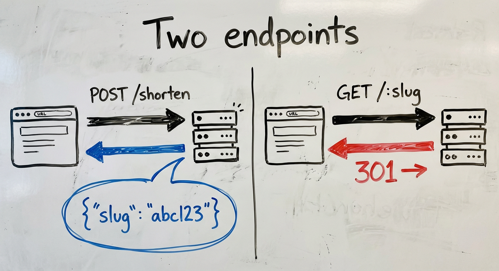
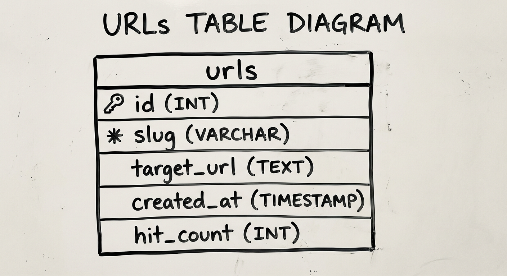
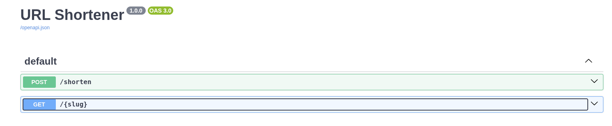
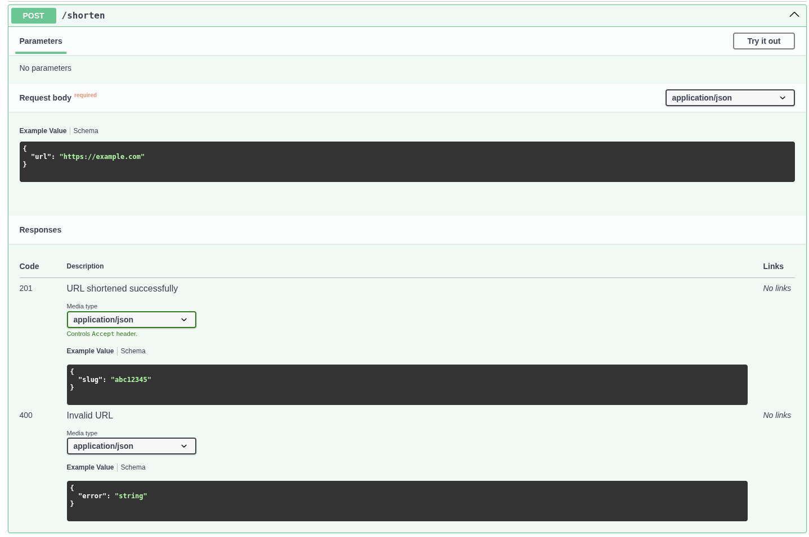
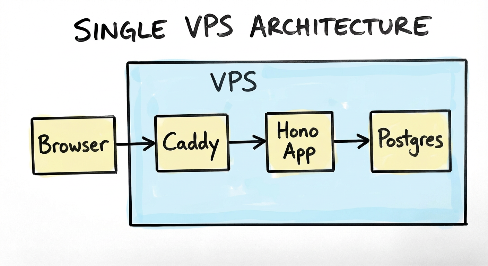
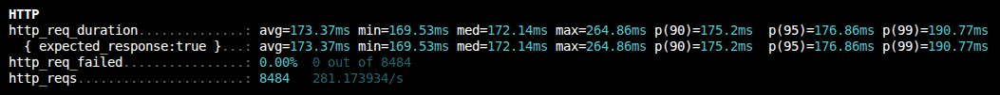
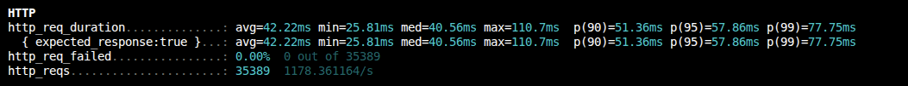

*TL;DR*: A minimal Hono + Postgres URL shortener with two endpoints and Swagger UI. This post establishes the baseline latency you'll use as a reference point throughout the series.

Have you ever been in an interview and they asked you, "Design a URL shortener."

That's it. That's the question. What was your answer? Was it anything like mine, which was just "two endpoints -- one to shorten, one to redirect, and that's it! Can I have a job now?"

There's a reason this is a classic interview question. It's not a trick question, but it is a weeder question. Many developers may fall into the trap of not understanding how complex a URL shortener actually could be. It's easy to think that it's just two endpoints and a single database table and that's all we need. What about what happens when there's a million requests per day against your API? Will your 1 vCPU VPS be able to handle it, or will you just keep adding more RAM and vCPU?

The goal of this series is to learn infrastructure concepts hands-on — not by following a curriculum, but by building something real and breaking it. A URL shortener is the perfect vehicle: it's trivial enough to understand in five minutes, and interesting enough to keep adding layers to.

This first post covers the foundation. No Redis, no load balancers, nothing clever. Just the app itself, and a baseline p95 you'll reference as we add Redis, load balancers, and more.

If you want to follow along, the repo can be found [here](https://github.com/abustamam/url-shortener).

## The app in two endpoints

```
POST /shorten   — takes a URL, returns a slug
GET  /:slug     — looks up the slug, redirects to the original URL
```

That's it. Everything in this series is about making these two endpoints faster, more resilient, and more observable. Keeping the app trivial is a feature — it means every new concept gets your full attention.



## Why Hono

I didn't want to think too much about the stack because the app isn't the point. So, I went with the simplest serverside framework that gives me OpenAPI specs: Hono. Hono is a small, fast web framework that runs on any JS runtime — Node, Bun, Cloudflare Workers, Deno. For this project, it has two things I care about:

1. **First-class TypeScript** — no ceremony, no workarounds
2. **`@hono/zod-openapi`** — schema validation and OpenAPI spec generation from the same source

That second point matters a lot, which I'll get to in a moment.

## Schema design

The database has one table:

```sql
CREATE TABLE urls (
  id         SERIAL PRIMARY KEY,
  slug       TEXT NOT NULL UNIQUE,
  target_url TEXT NOT NULL,
  created_at TIMESTAMPTZ NOT NULL DEFAULT now(),
  hit_count  INTEGER NOT NULL DEFAULT 0
);
```

I think the columns are pretty self-explanatory, but let's talk about `hit_count` for a second. `hit_count` just represents how often people are hitting this link. Under concurrency, two requests could both read the same count, increment it, and write back, losing one update. That's fine for a baseline. We'll fix it later.

One other decision worth noting: slug has a UNIQUE constraint, so the database enforces no collisions. The application layer doesn't need to worry about it.



## Slug generation: three approaches

There are three common ways to generate slugs, each with different tradeoffs:

| Approach | Example | Pros | Cons |
|----------|---------|------|------|
| **Random (nanoid)** | `gV5kXp` | No coordination needed, unpredictable | Slightly longer for the same collision resistance |
| **Hash of URL** | `sha256(url)[:7]` | Deterministic — same URL, same slug | Hash collisions require handling; leaks URL structure |
| **Sequential** | `0001`, `0002` | Short, predictable length | Requires coordination; enumerable (privacy concern) |

I went with nanoid (random). Sequential didn't seem appropriate because it makes concurrency difficult since we'd have to generate unique IDs without a central counter. Hash vs random was a toss-up, but random had fewer downsides. The right choice depends on whether leaking the URL structure is fine or not.

```ts
import { customAlphabet } from 'nanoid';

const nanoid = customAlphabet('0123456789abcdefghijklmnopqrstuvwxyz', 7);
```

A 7-character slug from a 36-character alphabet gives you ~78 billion possible combinations. At a million slugs created per day, you'd expect your first collision after roughly 200 years. This is why observability is important -- if a collision does happen, you need to know when and how frequently, and at that point you can reassess whether you want to keep with random or go with hashing, or use a long random slug.

## OpenAPI as documentation-as-code

`@hono/zod-openapi` lets you define your request/response schemas once, and get two things for free: **runtime validation** and **an OpenAPI spec**. The Swagger UI at `/docs` becomes your interactive frontend, no separate frontend needed.

```ts
const shortenRoute = createRoute({
  method: 'post',
  path: '/shorten',
  request: {
    body: {
      content: {
        'application/json': {
          schema: z.object({ url: z.string().url() }),
        },
      },
    },
  },
  responses: {
    200: {
      content: {
        'application/json': {
          schema: z.object({ slug: z.string(), short_url: z.string() }),
        },
      },
      description: 'Shortened URL',
    },
  },
});
```
I've always appreciated when API providers provide some sort of interactive playground. I can see the schema of inputs and outputs and run tests without touching my code. The result is a clean way to see all of your app's endpoints, and you can add whatever additional information necessary for your users, like when to use it, whether it's deprecated (and what to use instead), or any auth requirements. The result is a clean, self-documenting view of every endpoint.




## Deployment: single VPS behind Caddy

The deployment is intentionally simple: one Hetzner VPS, Caddy as a reverse proxy. Caddy handles TLS automatically. The app runs in a Docker container.

I'm using a 4vCPU and 8GB RAM Ubuntu box in a Helsinki datacenter ($5.99/mo) because that's just my lab box. But you probably don't even need that much; try it with the smallest you can get and if it doesn't work then you can always rescale. 

We'll be using docker compose to manage services. My docker-compose.yml looks like this:

```docker-compose.yml
services:
  postgres:
    image: postgres:16
    container_name: postgres
    environment:
      POSTGRES_USER: ${POSTGRES_USER:-postgres}
      POSTGRES_PASSWORD: ${POSTGRES_PASSWORD}
      POSTGRES_DB: ${POSTGRES_DB:-urlshortener}
    command:
      - "-c"
      - "shared_preload_libraries=pg_stat_statements"
      - "-c"
      - "pg_stat_statements.track=all"
      - "-c"
      - "pg_stat_statements.max=10000"
      - "-c"
      - "track_io_timing=on"
    volumes:
      - ./db-metadata-postgres/data:/var/lib/postgresql/data
      - ./db-metadata-postgres/backups:/backups
    healthcheck:
      test: ["CMD-SHELL", "pg_isready -U ${POSTGRES_USER:-postgres}"]
      interval: 10s
      timeout: 5s
      retries: 5
      start_period: 10s
    restart: unless-stopped

  url-shortener:
    image: ghcr.io/abustamam/url-shortener2:latest
    container_name: url-shortener
    environment:
      DATABASE_URL: postgresql://${POSTGRES_USER:-postgres}:${POSTGRES_PASSWORD}@postgres:5432/urlshortener
      PORT: 8082
    ports:
      - "8082:8082"
    depends_on:
      postgres:
        condition: service_healthy
    restart: unless-stopped

  caddy:
    image: caddy
    container_name: caddy
    ports:
      - "80:80"
      - "443:443"
    volumes:
      - ./Caddyfile:/etc/caddy/Caddyfile
      - ./caddy/data:/data
    depends_on:
      - url-shortener
    restart: unless-stopped

networks:
  default:
    name: srv-network
```

Use a .env to populate POSTGRES_USER, POSTGRES_PASSWORD, POSTGRES_DB if you want to change from the defaults.

My Caddyfile looks like this:

```Caddyfile
shrtn.bustamam.tech {
    reverse_proxy url-shortener:8082
}
```



A single-node setup is exactly right for Phase 1. It makes the baseline latency measurement meaningful — there's no load balancer, no network hops between services, nothing to confuse the numbers.

## Measuring the baseline

Before doing anything else, let's measure redirect latency. These will be referenced in every subsequent phase, and every optimization will be compared against these values.

We'll get our baseline values by load-testing our app in order to get a bunch of latency values, then do some math to determine statistical latencies. These are commonly called p50, p90, p95, p99. In p*n*, we are just talking about the *n*th percentile. This may sound like jargon, but it's just statistics, and fortunately, the math is simple. To get these numbers, we sort, then grab the value at the specified rank. So if we say p50, we look at the number that is at the 50% mark. Half of all entries will be lower, half will be higher. If we say p99, we are looking at the highest 1% of latencies, and this is where we typically want to spend our time optimizing as we scale. 1% of 100 is only 1, but 1% of 100,000 is 1,000. Those are real users who may be having real problems with your app.  

I'm going to use k6 because it natively outputs p50/p95/p99 in its summary, and it's scriptable in JS. There are plenty of other tools you could use, feel free to experiment.

I wrote this script:

```k6-baseline.js
import http from 'k6/http';
import { check, sleep } from 'k6';

// Replace with a real slug from your database before running
const SLUG = 'insert_slug_here';
const BASE_URL = 'insert_url_here';

export const options = {
  vus: 50,
  duration: '30s',
  summaryTrendStats: ['avg', 'min', 'med', 'max', 'p(90)', 'p(95)', 'p(99)'],
};

export default function () {
  const res = http.get(`${BASE_URL}/${SLUG}`, {
    redirects: 0, // measure the redirect response, not the final destination
  });

  check(res, {
    'status is 301 or 302': (r) => r.status === 301 || r.status === 302,
  });
}
```

`vus` represents "virtual users." This script will simulate 50 parallel "users" continuously looping through the default function exported here for the full 30 seconds. Each VU will make one request, and make another as soon as it receives a response.

Install k6 on your machine using the appropriate instructions from [here](https://grafana.com/docs/k6/latest/set-up/install-k6/?pg=get&plcmt=selfmanaged-box10-cta1).

Then run:
```bash
k6 run scripts/k6-baseline.js
```

You'll see a lot of stuff here. But you'll want to pay attention to `http_req_duration` because it represents the time from sending the request to receiving the response. `iteration_duration` includes any overhead around the request like setting up k6 on each iteration. 



| Percentile | Latency |
|------------|---------|
| p50 (med) | 172.14ms |
| p95 | 176.86ms |
| p99 | 190.77ms |

The distribution is pretty tight! 19ms between p50 and p99. The 170ms is almost certainly dominated by network round-trip to Helsinki, not app time.

If we want to disregard network latency and just test our Postgresql query, we can run this exact thing on our Hetzner box.



| Percentile | Latency |
|------------|---------|
| p50 (med) | 40.56ms |
| p95 | 57.86ms |
| p99 | 77.75ms |

Great! We saved about 120ms just from the round trip. Let's profile our Postgres query to make extra sure.

```bash
docker compose exec postgres   psql -U "${POSTGRES_USER:-postgres}" urlshortener   -c "EXPLAIN ANALYZE SELECT original_url FROM urls WHERE slug = 'WY3Ly9Yd';"
                                                   QUERY PLAN                                                    
-----------------------------------------------------------------------------------------------------------------
 Bitmap Heap Scan on urls  (cost=4.14..8.15 rows=1 width=20) (actual time=0.029..0.030 rows=1 loops=1)
   Recheck Cond: (slug = 'WY3Ly9Yd'::text)
   Heap Blocks: exact=1
   ->  Bitmap Index Scan on slug_idx  (cost=0.00..4.14 rows=1 width=0) (actual time=0.012..0.012 rows=1 loops=1)
         Index Cond: (slug = 'WY3Ly9Yd'::text)
 Planning Time: 0.419 ms
 Execution Time: 0.091 ms
(7 rows)
```

The planning time is the time postgres took to optimize the query. The execution time is the time to actually execute the query.

The important thing isn't the absolute numbers, it's having them. Every subsequent phase will change something about the system and we'll compare against this baseline.

The Postgres query takes 0.091ms to execute, so we can probably infer that Postgres is not the problem. The $40ms on the VPS is the full request pipeline, which includes Caddy, Docker networking, Hono, connection pool to Postgres, etc.

## What's next

Phase 2 adds Redis. Every redirect currently hits Postgres, but a redirect is a pure read, and the slug-to-URL mapping almost never changes. It's the ideal cache candidate. To reiterate, we are not trying to optimize speed of query -- we already established that it is already sub-millisecond above. The purpose is to eliminate _unnecessary_ queries.

But again, before we do any optimizations: measure, measure, measure. The baseline we establish here is the only honest way to know whether the next change actually helped.

> You can't manage what you don't measure.

---

*Disclaimer: I used AI to scaffold the implementation. All measurements, configuration decisions, and failure observations are from running this on a real VPS.*
