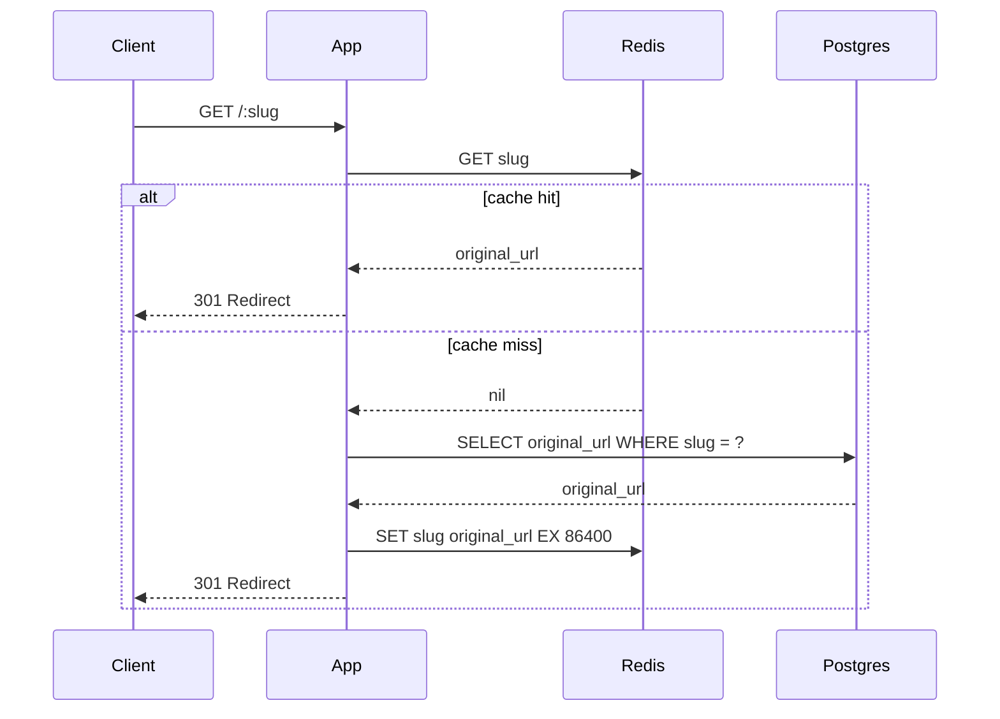

# Post 2 Draft — The Cache

> *I used AI to scaffold the implementation. All measurements, configuration decisions, and failure observations are from running this on a real VPS.*

---

**Title:** *I added Redis to my URL shortener — and had to think hard about cache invalidation*

**TL;DR:**
<!-- YOUR WORDS: 2-3 sentences. Something like: "Redirects are pure reads — a slug maps to a URL, and that mapping almost never changes. Adding Redis cache-aside dropped warm-path latency from Xms to Yms. The interesting work wasn't the cache — it was deciding what TTL to use and what to do when a URL gets deleted." -->

---

**Who this is for:** This post assumes you've read [Post 1](./phase-1.md) or are already running a working Hono + Postgres URL shortener. No prior Redis experience required — we'll cover what you need.

*New in this phase: ioredis 5.3.2*

---

**Intro hook:**
Adding a cache is the easy part. The hard part is deciding what to do when the underlying data changes. A URL shortener is almost insultingly simple, and even here cache invalidation requires real decisions.

---

## Why Redirects Are Perfect Cache Candidates

Before reaching for Redis, it's worth being explicit about why this particular endpoint benefits from a cache.

`GET /:slug` is a pure read. Given the same slug, it returns the same URL — always. The underlying data almost never changes after creation. And the read-to-write ratio is heavily skewed: for every `POST /shorten`, there are potentially thousands of `GET /:slug` hits.

That's the ideal cache candidate profile: **read-heavy, write-rare, frequently queried with the same key**.

A cache miss here costs one Postgres query — cheap, but not free. A cache hit costs one Redis lookup — nearly free. The math is straightforward once you think about it.

Contrast this with `POST /shorten`: every shorten is a new record. There's no "cache" for a write — it always needs the database. We won't cache that endpoint.

---

## The Cache-Aside Pattern

There are several ways to integrate a cache with a database. We're using **cache-aside** (also called lazy loading):

1. Check Redis for the slug key
2. On a **hit**: return the cached URL immediately — no database query
3. On a **miss**: query Postgres, populate the cache with a TTL, return the URL



The alternative is **write-through**: populate the cache on every write, so the cache is always warm. We're not using it here because writes are rare — there's no benefit to pre-populating an entry that might never be read again.

### The Redis client

```typescript
// src/lib/redis.ts
import { Redis } from 'ioredis'

const redis = new Redis(process.env.REDIS_URL ?? 'redis://127.0.0.1:6379')

redis.on('error', (err) => {
  console.error({ msg: 'Redis connection error', err })
})

export { redis }
```

A singleton client. The error handler prevents unhandled rejections from crashing the process — Redis connection drops happen in production, and they shouldn't take down the app.

### The updated `GET /:slug` handler

```typescript
// src/routes/redirect.ts
redirectRouter.openapi(redirectRoute, async (c) => {
  const { slug } = c.req.valid('param')

  // Check cache first
  const cached = await redis.get(slug)
  if (cached) {
    // Fire-and-forget hit count increment (same as before — doesn't block redirect)
    db.update(urls)
      .set({ hitCount: sql`${urls.hitCount} + 1` })
      .where(eq(urls.slug, slug))
      .execute()
      .catch(() => {})

    return c.redirect(cached, 301)
  }

  // Cache miss — query Postgres
  const result = await db
    .select()
    .from(urls)
    .where(eq(urls.slug, slug))
    .limit(1)

  if (result.length === 0) {
    return c.json({ error: 'Slug not found' }, 404)
  }

  const { originalUrl } = result[0]

  // Populate cache with TTL
  await redis.set(slug, originalUrl, 'EX', Number(process.env.CACHE_TTL_SECONDS ?? 86400))

  // Fire-and-forget hit count
  db.update(urls)
    .set({ hitCount: sql`${urls.hitCount} + 1` })
    .where(eq(urls.slug, slug))
    .execute()
    .catch(() => {})

  return c.redirect(originalUrl, 301)
})
```

A few things worth naming:

**On a cache hit, we still increment `hit_count`.** The counter lives in Postgres and is incremented regardless of whether Redis served the response. The two systems are tracking different things: Redis tracks the URL, Postgres tracks the usage.

**`CACHE_TTL_SECONDS` is an env var.** The right TTL depends on your use case. We'll discuss how to choose it in the next section.

**The cold path is now two round trips** (Redis + Postgres) instead of one. In practice Redis responds in <1ms, so this adds negligible overhead. But it's worth knowing — a "cache miss" with Redis is technically slower than no cache at all on that first request.

---

## The TTL Decision

TTL is the first real design decision in this phase. There's no universally correct answer — it depends on what you're optimizing for.

**Short TTL (minutes):** Frequent cache misses, more Postgres load, but stale data clears quickly. Good if URLs change often.

**Long TTL (hours/days):** Few cache misses, minimal Postgres load, but stale data lingers. Fine if URLs are immutable after creation.

For a URL shortener where slugs are created once and never modified, a long TTL is defensible. We're using 24 hours (`86400` seconds) as a starting point.

<!-- YOUR WORDS: What TTL did you settle on and why? Did you consider anything shorter?
     What does "stale data" actually mean here — when would a cached URL become wrong? -->

### What "stale" actually means

A cached slug becomes stale when the underlying record changes — either the `original_url` is updated, or the record is deleted entirely. For a URL shortener:

- **Updates are rare.** Most implementations don't allow updating a slug's destination. If yours does, you need to invalidate on update.
- **Deletions happen.** If you delete a URL from Postgres but don't invalidate Redis, the cache will serve a redirect for up to `CACHE_TTL_SECONDS` to a URL that no longer exists in your system.

The fix is to `DEL` from Redis whenever you delete from Postgres:

```typescript
// src/routes/shorten.ts (delete handler — you may not have this yet)
async function deleteSlug(slug: string) {
  await db.delete(urls).where(eq(urls.slug, slug))
  await redis.del(slug)   // evict from cache
}
```

<!-- YOUR WORDS: Did you implement a delete endpoint? If not, note that this edge case is
     a known deferral. What would happen in practice if a user deleted a slug and the cache
     served it for another 24 hours? -->

This is why cache invalidation has a reputation. It's not the TTL math that's hard — it's identifying all the places where the underlying data can change.

---

## Before and After

> **HANDS-ON — fill in with real numbers from your VPS**

Use the same method as Phase 1. First, get the baseline against a slug that exists in the database but has never been cached (restart Redis to clear it):

```bash
redis-cli FLUSHALL   # clear cache — do this on your VPS
```

Then run against a slug 20 times. The first request is a cold miss:

```bash
for i in {1..20}; do
  curl -o /dev/null -s -w "%{time_total}\n" https://yourdomain.com/<your-slug>
done
```

Record the results:

| Request | Phase 1 baseline (no cache) | Phase 2 cold (first hit) | Phase 2 warm (subsequent hits) |
|---------|----------------------------|--------------------------|-------------------------------|
| p50 | ___ ms | ___ ms | ___ ms |
| p95 | ___ ms | ___ ms | ___ ms |

**The cold path should be close to Phase 1** — it's doing the same Postgres query plus one Redis roundtrip. **The warm path should be noticeably faster** — it's only hitting Redis.

To observe the cache directly while requests land:

```bash
redis-cli MONITOR   # on your VPS — shows every Redis command in real-time
```

You'll see the `GET slug` on the first request return `nil`, followed by a `SET`, followed by subsequent `GET slug` commands returning the URL.

To verify the TTL was set correctly:

```bash
redis-cli TTL <your-slug>    # returns remaining seconds; -1 means no TTL; -2 means key doesn't exist
```

<!-- YOUR WORDS: What were the actual numbers? How much faster was the warm path?
     What surprised you about the cold vs. warm comparison?
     Did Redis latency on the miss path matter at all? -->

### Cache hit rate

After running some traffic, check the hit/miss ratio:

```bash
redis-cli INFO stats | grep -E "keyspace_hits|keyspace_misses"
# keyspace_hits:18
# keyspace_misses:2
```

<!-- YOUR WORDS: What was your cache hit rate in practice?
     A hit rate under 50% might suggest slugs are being created but never accessed again —
     worth investigating if you're trying to understand your traffic patterns. -->

---

## Trade-offs

Redis is now a required dependency. If Redis goes down, the cache is unavailable — but the app should still function by falling back to Postgres on every request. The error handler on the Redis client above prevents a connection error from crashing the process, but the redirect handler itself will throw if `redis.get()` rejects.

A production-grade implementation would wrap Redis calls in a try/catch and fall back to Postgres on Redis failure:

```typescript
// Cache-resilient lookup — degrades gracefully if Redis is unavailable
let cached: string | null = null
try {
  cached = await redis.get(slug)
} catch {
  // Redis unavailable — proceed with Postgres fallback
}
```

<!-- YOUR WORDS: Did you implement the try/catch fallback, or leave it as-is for now?
     What's the operational implication of Redis being a hard dependency vs. a soft one? -->

---

## Closer

The cache is working. Warm-path redirects are measurably faster, and the TTL decision is documented. Next phase: someone's about to start hammering `POST /shorten`. Time to rate limit them — and the algorithm choice matters more than you'd expect.

<!-- YOUR WORDS: Anything surprising about this phase? Any rough edges with the Redis setup?
     Mention the VPS deployment steps if anything was non-obvious. -->

---

## Further Reading

- [Redis documentation: Caching patterns](https://redis.io/docs/manual/patterns/)
- [ioredis documentation](https://github.com/redis/ioredis)
- Alex Xu — *System Design Interview*, Ch. 6 (Design a Key-Value Store)
- *Designing Data-Intensive Applications*, Ch. 1 — on caching and the cost of consistency
