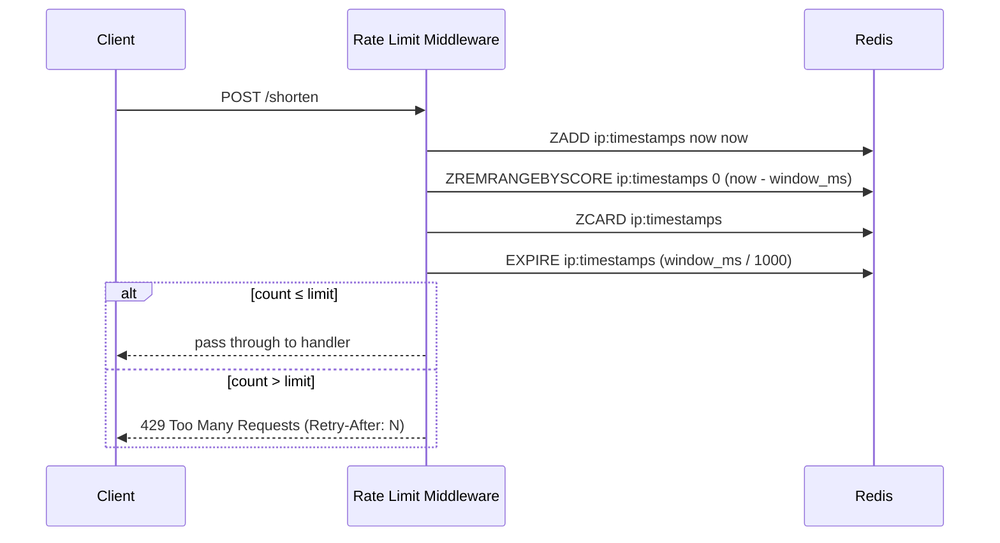

# Post 3 Draft — Rate Limiting

> *I used AI to scaffold the implementation. All measurements, configuration decisions, and failure observations are from running this on a real VPS.*

---

**Title:** *How I rate limited my URL shortener — and why the algorithm choice matters more than you'd think*

**TL;DR:**
<!-- YOUR WORDS: 2-3 sentences. Something like: "Before writing any rate limiting code, you have to choose an algorithm.
     Fixed window is simple but has a well-known exploit. Sliding window eliminates it at modest cost.
     For abuse prevention on POST /shorten, sliding window was the right call — and Redis makes the implementation clean." -->

---

**Who this is for:** This post assumes you've followed the series or are running a Hono app with Redis available. No prior knowledge of rate limiting algorithms required — that's exactly what we're covering.

*No new dependencies in this phase. Redis is already running from Phase 2.*

---

**Intro hook:**
"Add rate limiting" sounds like a one-liner. It isn't. Before you write any code, you have to choose an algorithm — and the choice has real consequences for user experience, fairness, and exploitability.

---

## The Three Algorithms

Rate limiting algorithms differ in how they define "too many requests in a time window." The differences matter.

### Fixed Window

The simplest approach: count requests per IP in a time bucket, reset the counter at the start of each new bucket.

```
minute 0 [00:00 - 00:59]  → 8 requests  → allowed (limit: 10)
minute 1 [01:00 - 01:59]  → 8 requests  → allowed
```

Redis implementation is two operations: `INCR key` and `EXPIRE key window_seconds`.

**The problem:** the window boundary is exploitable.

```
00:59 → 10 requests   (limit reached for minute 0)
01:00 → 10 requests   (new minute, counter resets)
```

That's 20 requests in 2 seconds — double the stated limit. Anyone who understands how your rate limiter works can exploit this by timing requests around the boundary. It's not a theoretical edge case; it's a known, documented exploit.

### Sliding Window

Sliding window fixes the boundary exploit by counting requests relative to *now*, not relative to a fixed clock boundary.

Instead of "how many requests in the current minute," it asks "how many requests in the last 60 seconds from this moment."

```
now = 01:30
window = 60s
→ count requests between 00:30 and 01:30
→ the boundary is always moving — there's no single reset moment to exploit
```

Redis implementation uses a sorted set: timestamps as both the score and the member value. On each request:
1. Add current timestamp to the set
2. Remove entries older than `now - window`
3. Count what remains
4. If count > limit, reject

Slightly more memory and CPU than fixed window — each IP has a sorted set of timestamps rather than a single counter. At the scale of this project, that cost is negligible.

### Token Bucket

Tokens accumulate at a steady rate (e.g., 1 token per second, max bucket size 10). Each request consumes one token. Requests are rejected when the bucket is empty.

Token bucket **allows bursts**: if you haven't made requests in 5 seconds, you accumulate 5 tokens and can make 5 requests back-to-back. This is good for APIs where legitimate users have bursty-but-normal traffic patterns.

It's harder to implement correctly without race conditions — you need to track both the token count and the last refill timestamp, atomically.

<!-- YOUR WORDS: Did you consider token bucket? Why did you rule it out for this use case?
     The key distinction: POST /shorten is an abuse prevention target, not a burst-tolerant API.
     A legitimate user shouldn't need to create 10 URLs in a second. -->

---

## Why Sliding Window for This App

The `POST /shorten` endpoint is a spam target. The goal is abuse prevention, not graceful burst tolerance.

Sliding window matches this goal:
- No exploitable boundary
- Predictable, auditable behavior ("you made N requests in the last 60 seconds")
- Clean Redis implementation



---

## The Implementation

```typescript
// src/middleware/rateLimit.ts
import type { Context, Next } from 'hono'
import { redis } from '../lib/redis'

const LIMIT = Number(process.env.RATE_LIMIT_MAX ?? 10)
const WINDOW_MS = Number(process.env.RATE_LIMIT_WINDOW_MS ?? 60_000)

export async function rateLimit(c: Context, next: Next) {
  // Get the client IP — trust the header your reverse proxy sets
  const ip =
    c.req.header('cf-connecting-ip') ??
    c.req.header('x-forwarded-for')?.split(',')[0].trim() ??
    'unknown'

  const key = `ratelimit:${ip}`
  const now = Date.now()
  const windowStart = now - WINDOW_MS

  const pipeline = redis.pipeline()
  pipeline.zadd(key, now, now.toString())
  pipeline.zremrangebyscore(key, 0, windowStart)
  pipeline.zcard(key)
  pipeline.expire(key, Math.ceil(WINDOW_MS / 1000))

  const results = await pipeline.exec()
  // zcard result is at index 2 (0-indexed after zadd, zremrangebyscore, zcard)
  const count = results?.[2]?.[1] as number ?? 0

  if (count > LIMIT) {
    // Calculate seconds until the oldest entry in the window expires
    const oldestEntry = await redis.zrange(key, 0, 0, 'WITHSCORES')
    const oldestTimestamp = oldestEntry[1] ? Number(oldestEntry[1]) : now
    const retryAfter = Math.ceil((oldestTimestamp + WINDOW_MS - now) / 1000)

    return c.json(
      { error: 'Too many requests', retryAfter },
      429,
      { 'Retry-After': retryAfter.toString() }
    )
  }

  await next()
}
```

A few things worth naming:

**Pipeline:** The four Redis operations run as a pipeline — sent in one round trip and executed atomically from the server's perspective. This avoids race conditions between the `ZADD` and `ZCARD` steps.

**Timestamps as both score and member:** The sorted set uses the Unix timestamp (milliseconds) as the score *and* the string representation of that timestamp as the member. The score enables range-based eviction (`ZREMRANGEBYSCORE`). The string-value member is just the bookkeeping payload — we only care about the count.

**`EXPIRE` on every request:** Without this, sorted sets for IPs that never exceed the limit would persist in Redis forever. Setting the TTL to the window duration ensures they expire cleanly.

**IP extraction:** We trust `CF-Connecting-IP` (Cloudflare) first, fall back to `X-Forwarded-For`. If neither is set, we fall back to `'unknown'` — which effectively rate-limits all unknown-origin traffic together. In production, make sure you know which header your reverse proxy sets and trust that one.

<!-- YOUR WORDS: What's your reverse proxy (Caddy)? What header does it set?
     Did you test that IP extraction was working correctly before deploying?
     Note: if X-Forwarded-For contains multiple IPs (proxies chained), we take the first one — the client IP. -->

### Applying the middleware

```typescript
// src/routes/shorten.ts
import { rateLimit } from '../middleware/rateLimit'

shortenRouter.use('/shorten', rateLimit)

shortenRouter.openapi(shortenRoute, async (c) => {
  // ... existing handler unchanged
})
```

The middleware only applies to `/shorten`. Redirects (`GET /:slug`) are deliberately not rate limited — they're the product. Throttling redirects would punish end users following short links.

---

## The 429 Response

```json
HTTP/2 429 Too Many Requests
Retry-After: 47
Content-Type: application/json

{
  "error": "Too many requests",
  "retryAfter": 47
}
```

`Retry-After` is the number of seconds until the oldest request in the current window drops out of the count — the earliest moment the client could make another request without being rejected.

Well-behaved clients (and Swagger UI) can use this to back off automatically. The header is standardized in [RFC 9110](https://www.rfc-editor.org/rfc/rfc9110.html#name-retry-after).

<!-- YOUR WORDS: Did you test this from the client side? What does Swagger UI do with a 429?
     Does the Retry-After value feel accurate when you actually wait and retry? -->

---

## Testing It

> **HANDS-ON — run this and observe the transition**

```bash
for i in {1..15}; do
  curl -s -o /dev/null -w "%{http_code}\n" \
    -X POST https://yourdomain.com/shorten \
    -d '{"url":"https://example.com"}' \
    -H 'Content-Type: application/json'
done
```

You should see the first 10 return `201`, then the remaining 5 return `429`.

To see the `Retry-After` header:

```bash
curl -s -i -X POST https://yourdomain.com/shorten \
  -d '{"url":"https://example.com"}' \
  -H 'Content-Type: application/json' \
  2>&1 | grep -E "HTTP|Retry-After"
```

To verify the window resets: wait the number of seconds shown in `Retry-After`, then confirm a new request returns `201`.

To observe the sorted set directly in Redis:

```bash
redis-cli ZRANGE ratelimit:<your-ip> 0 -1 WITHSCORES
```

<!-- YOUR WORDS: What happened when you ran this? Was the transition from 201 to 429 exactly at request 11?
     Did the Retry-After value match reality when you waited and retried?
     Describe what the sorted set looked like in redis-cli while requests were coming in. -->

---

## Trade-offs

**In-memory rate limiters** (a `Map<ip, timestamps[]>` in the process) are simpler to implement and have zero network overhead. But they don't survive restarts, don't work across multiple app instances, and can't be inspected externally. We'll see in Phase 4 why Redis was the right call: when we add a second app node, the rate limit state is already shared.

**Sliding window memory cost:** Each IP's sorted set holds one entry per request within the window. With a 60-second window and a limit of 10 requests, each IP uses at most 10 entries. At realistic scale (thousands of unique IPs), this is kilobytes of Redis memory — entirely acceptable.

**Distributed abuse** (many IPs, each below the limit) isn't addressed by per-IP rate limiting. That requires a different layer — WAF rules, Cloudflare, or a global request budget. Per-IP limiting stops naive abuse; it doesn't stop coordinated attacks.

<!-- YOUR WORDS: Did the production traffic surface any edge cases?
     Any IPs that hit the limit legitimately (e.g., automated systems sharing an IP)? -->

---

## Closer

Rate limiting is a shared-state problem — it works because Redis is available to all app processes. That shared-state dependency becomes the central point in the next post, when we add a second server and audit every piece of state the app holds. The fact that we chose Redis over in-memory for this middleware will make horizontal scaling almost trivial.

<!-- YOUR WORDS: How did this phase feel compared to Phase 2? Was the algorithm research the hard part,
     or the implementation? -->

---

## Further Reading

- Alex Xu — *System Design Interview*, Ch. 4 (Design a Rate Limiter) — covers all three algorithms with diagrams
- [Redis sorted set commands](https://redis.io/docs/data-types/sorted-sets/)
- [RFC 9110 — Retry-After header](https://www.rfc-editor.org/rfc/rfc9110.html#name-retry-after)
- Cloudflare blog: [How Cloudflare implements rate limiting at scale](https://blog.cloudflare.com/counting-things-a-lot-of-different-things/)
