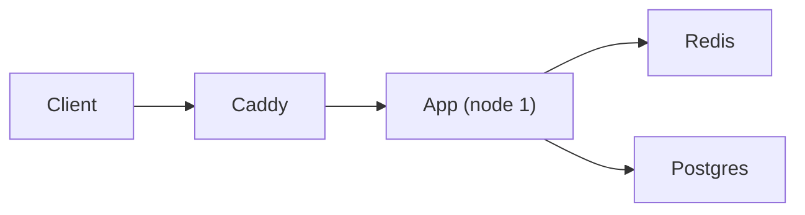
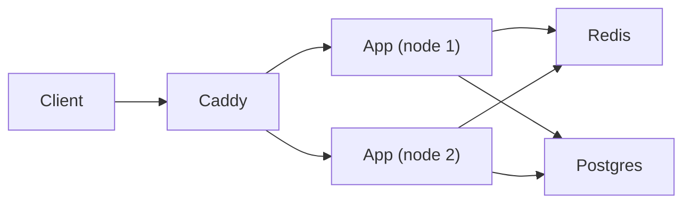

# Post 4 Draft — Horizontal Scaling

> *I used AI to scaffold the implementation. All measurements, configuration decisions, and failure observations are from running this on a real VPS.*

---

**Title:** *I added a second server to my URL shortener — here's what broke*

**TL;DR:**
<!-- YOUR WORDS: 2-3 sentences. Something like: "Adding a second server was straightforward because every earlier decision
     treated state as external. Redis holds the cache and rate limit counters. Postgres holds the data.
     The only real 'what broke' moment was discovering that localhost URLs obviously don't work from node 2 —
     and that realization clarified what statelessness actually means in practice." -->

---

**Who this is for:** This post assumes you've followed the series. You should understand what a reverse proxy does and have basic familiarity with Linux services. No prior distributed systems experience required.

*No new application dependencies. Infrastructure change only: a second VPS, an updated Caddyfile.*

---

**Intro hook:**
Horizontal scaling sounds scary until you understand what it actually requires. For this app, adding a second server was almost trivially easy — because of decisions made in earlier phases. Here's what those decisions were, and what would have broken if we'd made different ones.

---

## What "Stateless" Actually Means

The textbook definition: any request can be handled by any server.

The practical definition: no server stores anything that another server can't access.

If a server holds state that isn't shared — an in-memory session map, a local file, a process-level cache — then requests must be routed to the specific server that holds that state. You lose the ability to route anywhere.

What breaks when you add a second server to a stateful app:

- **In-memory session store:** user logs into node 1, session lives in node 1's memory. Node 2 has no record of the session. User's next request hits node 2 and appears logged out.
- **Node-local cache:** node 1 warms its cache with Redis lookups. Node 2 starts cold. Every request to node 2 is a cache miss that goes to Postgres — adding load instead of relieving it.
- **In-memory rate limiter:** each node tracks its own per-IP counter. An attacker splits 20 requests evenly across both nodes — each node sees 10, neither triggers the limit. The rate limit is silently broken.

This list isn't theoretical. These are real failure modes that bite real teams.

<!-- YOUR WORDS: Have you seen any of these in the wild? Was there a moment reading this list where something clicked?
     Set up the comparison for your readers: we'll now audit this app and see whether any of these apply. -->

---

## Auditing the App's State

Before adding a second node, do an explicit audit: what state does this app hold, and where does it live?

| State | Lives in | Accessible by both nodes? | Notes |
|-------|----------|--------------------------|-------|
| URL records | Postgres | ✅ Yes | Both nodes connect to the same instance |
| Redirect cache | Redis | ✅ Yes | Populated by either node, read by either |
| Rate limit counters | Redis | ✅ Yes | This is why we chose Redis over in-memory in Phase 3 |
| In-flight HTTP request | Process memory | N/A | Stateless HTTP — no cross-request state |
| OpenAPI spec | Compiled into the binary | ✅ Yes (same code, same spec) | |

Result: nothing node-local. Every piece of mutable state is in Postgres or Redis.

<!-- YOUR WORDS: Go through the actual codebase and confirm this audit is complete.
     Are there any global variables, module-level Maps, or in-process caches you added along the way?
     Document what you actually found. -->

This is the payoff of Phase 2 and Phase 3. We could have implemented the cache as an in-process `Map<slug, url>` — simpler, zero network overhead, one less dependency. We could have rate-limited with a `Map<ip, timestamps[]>`. Both would have worked fine on a single node. Neither would work correctly on two.

---

## The Architecture Change

Before:



After:



Caddy distributes requests across both nodes. Redis and Postgres remain on node 1 (or a dedicated host — network-accessible from both).

---

## The Health Check Endpoint

Caddy needs a way to know whether a node is alive. We add a `GET /health` endpoint for this:

```typescript
// src/routes/health.ts
import { Hono } from 'hono'

export const healthRouter = new Hono()

healthRouter.get('/health', (c) => {
  return c.json({ status: 'ok' })
})
```

```typescript
// src/index.ts
app.route('/', healthRouter)
```

This endpoint intentionally does nothing except return 200. We're not checking database connectivity here — that's a deeper health check (sometimes called a "readiness probe") that involves more tradeoffs. For our load balancer's purposes, 200 means the process is alive and accepting connections.

<!-- YOUR WORDS: Did you consider a deeper health check (e.g., pinging Redis and Postgres)?
     What's the argument for keeping it simple? What would a false positive look like
     (process alive, database unreachable)? -->

---

## The Caddyfile Update

```caddy
yourdomain.com {
  reverse_proxy node1_ip:3000 node2_ip:3000 {
    health_uri     /health
    health_interval 10s
    health_timeout  5s
  }
}
```

`health_uri /health` tells Caddy to ping this path on each upstream every `health_interval`. If the check fails, the upstream is removed from rotation until it recovers.

`round_robin` is the default load balancing policy — requests are distributed evenly, one at a time, across all healthy upstreams. This is the right choice when response times are similar across nodes, which they are here.

<!-- YOUR WORDS: Replace node1_ip and node2_ip with your actual private network IPs.
     Did you use Hetzner's private network feature, or public IPs with firewall rules?
     Note: for production, you wouldn't want app nodes publicly reachable — traffic should only come through the load balancer. -->

---

## The Chaos Test

> **HANDS-ON — run this and observe the failover**

With both nodes running and traffic flowing:

**Step 1: confirm both nodes are receiving traffic.**

Tail logs on both simultaneously (in two terminals):

```bash
# terminal 1 — node 1
journalctl -u url-shortener -f

# terminal 2 — node 2
journalctl -u url-shortener -f
```

Send 20 requests from a third terminal:

```bash
for i in {1..20}; do
  curl -s -o /dev/null -w "%{http_code}\n" https://yourdomain.com/<your-slug>
done
```

Both log streams should show requests.

**Step 2: kill node 1.**

```bash
systemctl stop url-shortener   # on node 1
```

Wait up to 10 seconds (the health check interval), then send more requests. All should hit node 2 now.

**Step 3: observe Caddy's behavior.**

```bash
journalctl -u caddy -f   # on the Caddy host
```

<!-- YOUR WORDS: What did the Caddy logs actually show when node 1 went down?
     How long did it take for Caddy to remove node 1 from rotation?
     Were there any failed requests during the failover window?
     Paste or paraphrase the actual log lines — this is real data, not hypothetical. -->

**Step 4: restart node 1 and confirm it re-enters rotation.**

```bash
systemctl start url-shortener   # on node 1
```

Wait for the health check to pass. Both nodes should start receiving traffic again.

<!-- YOUR WORDS: How long did re-entry take? Did Caddy immediately start sending traffic to node 1
     after the first successful health check, or did it wait for multiple successes? -->

---

## What Would Have Broken

Thought experiments that make the lesson concrete:

**If we'd used an in-memory rate limiter (Phase 3):**
Each node maintains its own counter per IP. An attacker makes 5 requests per second, alternating IPs or load-balanced across nodes. Each node sees 2-3 requests — well below the per-node limit. The rate limiter appears to work but is trivially bypassed.

**If we'd cached redirects in-process:**
Node 2 starts cold. Every request to node 2 is a Postgres lookup. As traffic grows, adding nodes doesn't relieve Postgres — it increases load. The cache that was supposed to help now hurts at scale.

**If we'd stored sessions in memory:**
Users authenticated against node 1 get logged out when their next request hits node 2. The bug is intermittent (depends on which node you hit) and difficult to reproduce. Classic sticky-session debugging nightmare.

None of these would have been obvious at Phase 1 with one node. They surface exactly when you scale.

---

## Measurement

> **HANDS-ON — confirm latency hasn't regressed**

Run the same 20-request curl loop from Phase 1 and compare:

| Metric | Phase 1 (1 node, no cache) | Phase 2 (1 node, warm cache) | Phase 4 (2 nodes, warm cache) |
|--------|---------------------------|------------------------------|-------------------------------|
| p50 | ___ ms | ___ ms | ___ ms |
| p95 | ___ ms | ___ ms | ___ ms |

Phase 4 latency should be similar to Phase 2 — the gain from adding nodes is **availability and throughput**, not single-request speed.

<!-- YOUR WORDS: What were the actual numbers? Did anything change?
     Any variance from requests being load-balanced across nodes with slightly different characteristics?
     (Nodes with slightly different clock drift, different kernel versions, etc.) -->

---

## Trade-offs

**Single-region:** Both nodes and the shared Postgres/Redis are in the same datacenter. A datacenter outage takes everything down. That's a deliberate simplification — multi-region introduces replication, latency, and consistency tradeoffs that deserve their own series.

**No automatic failover for Postgres:** Both nodes point at the same Postgres instance. If Postgres goes down, the entire app is down regardless of how many app nodes are running. Postgres replication and failover is Phase 6.

**Health check window:** With `health_interval 10s`, there's a window of up to 10 seconds during which a dead node receives traffic before Caddy removes it. Clients see errors during that window. You can tune this down, but there's a cost: more frequent health checks increase load.

<!-- YOUR WORDS: Did the health check interval matter in practice?
     Was 10 seconds an acceptable window for your use case? -->

---

## Closer

Scaling out was easy because the app was built to be stateless. Now that we have two nodes and shared infrastructure, the next question is: what's actually happening across all of this? When a request is slow, is it Redis? Postgres? The app itself? We have no way to answer that yet. That's observability, and it's the next phase.

<!-- YOUR WORDS: How did this phase feel in terms of effort vs. impact?
     Was it anticlimactic because everything just worked? If so, say so — that's the lesson. -->

---

## Further Reading

- *Designing Data-Intensive Applications*, Ch. 1 — Reliability, Scalability, Maintainability
- [Caddy reverse_proxy directive](https://caddyserver.com/docs/caddyfile/directives/reverse_proxy) — full docs on health checks and load balancing policies
- [The 12-Factor App — Factor VI: Processes](https://12factor.net/processes) — the canonical statement on statelessness
- [Hetzner Private Networks](https://docs.hetzner.com/cloud/networks/overview/) — how to keep app-to-database traffic off the public internet
