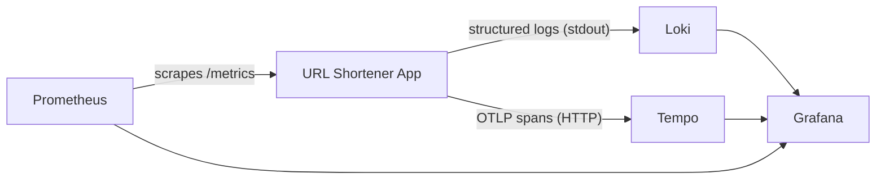

# Post 5 Draft — Observability

> *I used AI to scaffold the implementation. All measurements, configuration decisions, and failure observations are from running this on a real VPS.*

---

**Title:** *I instrumented my URL shortener with the full Grafana LGTM stack — here's what I found*

**TL;DR:**
<!-- YOUR WORDS: 2-3 sentences. Something like: "Logs tell you what happened. Metrics tell you how often.
     Traces tell you where time went. After instrumenting with Prometheus, Loki, Tempo, and Grafana,
     the most useful single number was cache hit rate — and it was lower than expected for a reason
     that only showed up in the data." -->

---

**Who this is for:** This post assumes you've followed the series. Familiarity with what a log line and a database query are is enough — no prior Prometheus, Grafana, or OpenTelemetry experience required.

*New in this phase: pino 9.6.0, pino-loki 2.3.0, prom-client 15.1.3, @opentelemetry/sdk-node 0.57.2, @opentelemetry/auto-instrumentations-node 0.58.0*

---

**Intro hook:**
Logs tell you what happened. Metrics tell you how often. Traces tell you where time went. You need all three to answer questions about a live system — and building a simple app is the best time to learn why.

---

## Why You Need All Three

Start with a concrete scenario. Imagine you wake up at 2am to an alert: p95 redirect latency has spiked from 15ms to 400ms. What do you do?

**With only logs:** You can find the slow requests and see that they're all on `GET /:slug`. You can't tell whether the slowness is in Redis, Postgres, or the app itself.

**With only metrics:** You can see the latency spike on a chart, confirm it's ongoing, and correlate it with the request rate. You can't find the specific requests that were slow or trace them through the stack.

**With traces:** You click on a slow request and see a span waterfall: the app spent 2ms in Redis and 380ms waiting for Postgres. You now know exactly where to look.

Each pillar answers questions the others can't. You don't realize you need all three until the first time you try to debug a production incident with only two.

<!-- YOUR WORDS: Have you ever debugged a production issue with insufficient observability?
     This section lands harder with a real example. If you have one, use it. -->

---

## The Stack

| Tool | Pillar | What it does |
|------|--------|-------------|
| Pino | Logs | Structured JSON logging in-app |
| Loki | Logs | Log aggregation and querying |
| prom-client | Metrics | Expose `/metrics` in Prometheus format |
| Prometheus | Metrics | Scrape and store time-series metrics |
| OpenTelemetry SDK | Traces | Instrument the app, emit spans |
| Tempo | Traces | Store and query distributed traces |
| Grafana | All three | Unified dashboards connecting all backends |

How they connect:



The observability stack runs as a separate Docker Compose file alongside the app. It doesn't affect the application's behavior — it only observes it.

---

## Pillar 1: Structured Logging (Pino + Loki)

### Why structured logs

`console.log("cache miss for slug: " + slug)` is a string. You can grep it. That's all.

`logger.info({ slug, latencyMs }, 'cache miss')` is a JSON object. You can filter by `level`, group by `slug`, calculate p99 of `latencyMs`, and query across millions of log lines in Grafana with a few keystrokes.

The discipline is: log data as key-value pairs, not as sentences.

### Setup

```typescript
// src/lib/logger.ts
import pino from 'pino'

export const logger = pino({
  level: process.env.LOG_LEVEL ?? 'info',
  transport:
    process.env.NODE_ENV === 'production'
      ? {
          targets: [
            {
              target: 'pino-loki',
              options: {
                host: process.env.LOKI_HOST ?? 'http://localhost:3100',
                labels: { service: 'url-shortener' },
              },
            },
          ],
        }
      : undefined,  // dev: pretty-print to stdout
})
```

In development, Pino writes to stdout in a readable format. In production, `pino-loki` ships logs directly to Loki over HTTP.

### What to log

Replace the `console.log` calls in each handler with structured log calls:

```typescript
// src/routes/redirect.ts (updated logging)
const cached = await redis.get(slug)
if (cached) {
  logger.info({ slug, source: 'cache' }, 'redirect served')
  return c.redirect(cached, 301)
}

logger.info({ slug, source: 'db' }, 'cache miss — querying postgres')
// ... db query ...
logger.info({ slug, source: 'db', cached: true }, 'redirect served')
```

**What to log:** request details, cache hit/miss with the slug, errors with the full context.

**What not to log:** raw `original_url` values. Short links can contain sensitive tokens or PII in query parameters. Log the slug, not the destination.

<!-- YOUR WORDS: Did you have to think about what to redact? Were there any log lines
     where you almost logged something you shouldn't have? -->

### Querying in Grafana

Once Loki is running and receiving logs, you can query from Grafana's Explore view:

```logql
{service="url-shortener"}                           # all logs
{service="url-shortener"} |= "cache miss"           # only cache misses
{service="url-shortener"} | json | source="cache"   # JSON-parsed, filter by field
```

<!-- YOUR WORDS: What did the Loki query interface feel like compared to grep?
     Did any query you expected to write turn out to be harder or easier than expected? -->

---

## Pillar 2: Metrics (prom-client + Prometheus)

### The RED method

For any service, three metrics tell most of the story:

- **Rate:** requests per second
- **Errors:** error rate (4xx, 5xx as a fraction of total)
- **Duration:** latency histogram — p50, p95, p99

Everything else is a refinement of these three. Start here.

### Setup

```typescript
// src/lib/metrics.ts
import { Registry, Counter, Histogram } from 'prom-client'

export const register = new Registry()

export const httpRequestDuration = new Histogram({
  name: 'http_request_duration_seconds',
  help: 'Duration of HTTP requests in seconds',
  labelNames: ['method', 'route', 'status'],
  buckets: [0.005, 0.01, 0.025, 0.05, 0.1, 0.25, 0.5, 1, 2.5],
  registers: [register],
})

export const cacheHits = new Counter({
  name: 'cache_hits_total',
  help: 'Total number of cache hits on GET /:slug',
  registers: [register],
})

export const cacheMisses = new Counter({
  name: 'cache_misses_total',
  help: 'Total number of cache misses on GET /:slug',
  registers: [register],
})

export const httpRequestsTotal = new Counter({
  name: 'http_requests_total',
  help: 'Total number of HTTP requests',
  labelNames: ['method', 'route', 'status'],
  registers: [register],
})
```

A custom registry keeps our metrics isolated — no risk of accidentally including default Node.js metrics we didn't intend to expose.

### Instrumenting the hot path

```typescript
// src/routes/redirect.ts (with metrics)
import { httpRequestDuration, cacheHits, cacheMisses } from '../lib/metrics'

redirectRouter.openapi(redirectRoute, async (c) => {
  const { slug } = c.req.valid('param')
  const timer = httpRequestDuration.startTimer({ method: 'GET', route: '/:slug' })

  const cached = await redis.get(slug)
  if (cached) {
    cacheHits.inc()
    timer({ status: 301 })
    return c.redirect(cached, 301)
  }

  cacheMisses.inc()
  const result = await db.select().from(urls).where(eq(urls.slug, slug)).limit(1)

  if (result.length === 0) {
    timer({ status: 404 })
    return c.json({ error: 'Slug not found' }, 404)
  }

  await redis.set(slug, result[0].originalUrl, 'EX', Number(process.env.CACHE_TTL_SECONDS ?? 86400))
  timer({ status: 301 })
  return c.redirect(result[0].originalUrl, 301)
})
```

### The `/metrics` endpoint

```typescript
// src/routes/metrics.ts
import { Hono } from 'hono'
import { register } from '../lib/metrics'

export const metricsRouter = new Hono()

metricsRouter.get('/metrics', async (c) => {
  return c.text(await register.metrics(), 200, {
    'Content-Type': register.contentType,
  })
})
```

```typescript
// src/index.ts
app.route('/', metricsRouter)
```

Prometheus scrapes this endpoint on a configurable interval (typically 15s). The app doesn't push — Prometheus pulls.

### Why histograms, not averages

An average latency of 15ms can hide a p99 of 400ms — 1% of users experiencing 26× worse performance, completely invisible in the mean.

A histogram records the full distribution. In Prometheus, you can query any percentile:

```promql
# p99 redirect latency over the last 5 minutes
histogram_quantile(0.99,
  rate(http_request_duration_seconds_bucket{route="/:slug"}[5m])
)
```

<!-- YOUR WORDS: When you first saw the histogram in Grafana, was there a gap between p50 and p99?
     What did that tell you? -->

### Cache hit rate

```promql
# Fraction of requests served from cache
rate(cache_hits_total[5m]) /
  (rate(cache_hits_total[5m]) + rate(cache_misses_total[5m]))
```

<!-- YOUR WORDS: What was your actual cache hit rate under real traffic?
     If it was lower than expected, what was the reason?
     (Common cause: test slugs created and never accessed again, or a crawler creating new short URLs.) -->

---

## Pillar 3: Distributed Traces (OTel + Tempo)

### What a trace is

A trace is a tree of spans. The root span is the HTTP request. Each operation within that request — a Redis lookup, a Postgres query, a serialization step — is a child span.

The trace answers: "where in the stack did time go during this specific request?"

For a cache-miss redirect, the waterfall looks like:

```
GET /:slug (total: 28ms)
├── redis GET (5ms)
├── postgres SELECT (20ms)
└── redis SET (3ms)
```

For a cache-hit redirect:

```
GET /:slug (total: 6ms)
└── redis GET (5ms)
```

The contrast makes it immediately clear what caching is buying you.

### Setup

OpenTelemetry's `auto-instrumentations-node` package handles Hono, Redis (ioredis), and Postgres (pg) automatically — you don't have to manually wrap every operation.

```typescript
// src/lib/tracing.ts — must be imported before anything else
import { NodeSDK } from '@opentelemetry/sdk-node'
import { getNodeAutoInstrumentations } from '@opentelemetry/auto-instrumentations-node'
import { OTLPTraceExporter } from '@opentelemetry/exporter-trace-otlp-http'

const sdk = new NodeSDK({
  serviceName: process.env.OTEL_SERVICE_NAME ?? 'url-shortener',
  traceExporter: new OTLPTraceExporter({
    url: `${process.env.OTEL_EXPORTER_OTLP_ENDPOINT ?? 'http://localhost:4318'}/v1/traces`,
  }),
  instrumentations: [
    getNodeAutoInstrumentations({
      '@opentelemetry/instrumentation-fs': { enabled: false },  // too noisy
    }),
  ],
})

sdk.start()

process.on('SIGTERM', () => sdk.shutdown())
```

Import this at the very top of `src/index.ts` — before any other imports — so the SDK can patch Node's built-in modules before they're used:

```typescript
// src/index.ts
import './lib/tracing'
import { OpenAPIHono } from '@hono/zod-openapi'
// ...
```

<!-- YOUR WORDS: Did the auto-instrumentation work out of the box, or did you need to configure anything?
     Were there any spans you expected to see that weren't appearing? -->

### Viewing traces in Grafana

Once Tempo is receiving data, open Grafana's Explore panel, select Tempo as the data source, and search for traces by service name. Click any trace to see the span waterfall.

The useful flow: see a high-latency request in the Prometheus latency panel → correlate to a trace in Tempo (Grafana's "exemplars" feature links these directly when configured) → identify which span is slow.

<!-- YOUR WORDS: Describe what you actually saw in Tempo for a cache-miss request vs. a cache-hit request.
     Were the span durations what you expected? Were there any surprising spans?
     Did the auto-instrumentation capture the Redis operations correctly? -->

---

## The Dashboard

Four panels, each answering one question:

**Panel 1: Redirect latency percentiles**
```promql
histogram_quantile(0.50, rate(http_request_duration_seconds_bucket{route="/:slug"}[5m]))
histogram_quantile(0.95, rate(http_request_duration_seconds_bucket{route="/:slug"}[5m]))
histogram_quantile(0.99, rate(http_request_duration_seconds_bucket{route="/:slug"}[5m]))
```
Question: *Is the app fast?*

**Panel 2: Cache hit rate**
```promql
rate(cache_hits_total[5m]) / (rate(cache_hits_total[5m]) + rate(cache_misses_total[5m]))
```
Question: *Is caching working?*

**Panel 3: Request rate**
```promql
rate(http_requests_total{route="/:slug"}[1m])
```
Question: *How much traffic am I handling?*

**Panel 4: Error rate**
```promql
rate(http_requests_total{status=~"5.."}[5m]) / rate(http_requests_total[5m])
```
Question: *Is something broken?*

<!-- YOUR WORDS: Walk through what each panel showed under real traffic.
     Did any panel surface something you didn't expect?
     The cache hit rate panel is particularly interesting — what did it tell you? -->

---

## What the Numbers Revealed

> **HANDS-ON — fill in from your actual observations**

This section must be written from what you actually saw on your running system. The following is a template for the kinds of things worth documenting:

- **Cache hit rate:** Was it what you expected? If it was lower than ~80%, investigate why — the most common cause is slugs created but never accessed again (test traffic, bots, etc.)
- **Latency distribution:** What was the gap between p50 and p99? A wide gap suggests something non-deterministic (Postgres autovacuum, GC pauses, Redis connection pool contention).
- **Any latency spike you observed:** When did it happen, what did the trace show was the cause?

<!-- YOUR WORDS: Write what you actually found. This section is the core of the post.
     The reader is here for your real observations, not the scaffold.
     Be specific: "cache hit rate was 62%" beats "cache hit rate was lower than expected."
     Include the actual trace screenshot if you found something interesting. -->

---

## Trade-offs

**Operational complexity:** The LGTM stack is four new services (Loki, Prometheus, Tempo, Grafana). That's meaningful. At this project's scale, running them all on one VPS with `docker compose` is fine; at production scale, each has scaling and retention considerations.

**Cardinality:** Prometheus metrics become exponentially expensive if you add high-cardinality labels (e.g., one label per slug). Keep label values bounded and low-cardinality. We label by route and status code — both are small, finite sets.

**OTel overhead:** The instrumentation adds a small amount of latency per request — typically <1ms for creating and exporting spans. Measure it against your Phase 4 baseline. If you see a regression, it's worth noting.

**Loki vs. Elasticsearch:** Loki stores logs more cheaply by design (labels, not full-text indexing). The tradeoff is less powerful full-text search. For this use case — structured JSON logs with known field names — Loki is the right choice.

<!-- YOUR WORDS: Did the observability stack add any measurable overhead to request latency?
     Note what you observed, not what you'd expect. -->

---

## Closer

You now have a fully observable system. Logs tell you what happened on each request. Metrics tell you how the system is behaving over time. Traces tell you where time went inside a single request. The next phase adds a Postgres read replica — and the observability stack will be essential for measuring replication lag when you intentionally break things.

<!-- YOUR WORDS: What was the most useful thing the observability stack revealed that you hadn't known before?
     Was there a "this is why observability matters" moment? -->

---

## Further Reading

- [OpenTelemetry documentation](https://opentelemetry.io/docs/)
- [Grafana LGTM stack overview](https://grafana.com/oss/)
- Tom Wilkie — [The RED Method](https://grafana.com/blog/2018/08/02/the-red-method-how-to-instrument-your-services/) — the original post
- [prom-client documentation](https://github.com/siimon/prom-client)
- *Observability Engineering* by Charity Majors, Liz Fong-Jones, and George Miranda — the definitive book on this topic
