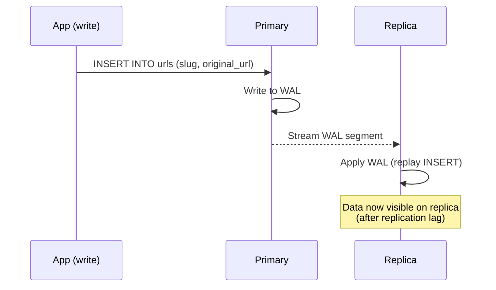

# Post 6 Draft — Database Replication (Stretch)

> *I used AI to scaffold the implementation. All measurements, configuration decisions, and failure observations are from running this on a real VPS.*

---

**Title:** *I added Postgres replication to my URL shortener — then killed the primary*

**TL;DR:**
<!-- YOUR WORDS: 2-3 sentences. Something like: "Postgres streaming replication sends the write-ahead log
     from primary to replica in near-real-time. Routing redirect reads to the replica offloads the primary
     meaningfully. The interesting part: killing the primary shows you exactly what replication does and
     doesn't give you. Reads kept working. Writes failed immediately, with a specific, observable error." -->

---

**Who this is for:** This post assumes you've followed the series and have Postgres running in production. Basic SQL familiarity is enough — no prior replication experience needed.

*No new application dependencies. Infrastructure change: a second Postgres VPS running as a streaming replica.*

---

**Intro hook:**
"Eventual consistency" is a phrase that sounds abstract until you watch a read replica serve a slug that was just created on the primary — and then doesn't, for 200 milliseconds. That's what this post is about.

---

## Why Replication?

`GET /:slug` vastly outnumbers `POST /shorten`. For every URL created, it might be accessed thousands of times. The read/write ratio is heavily skewed toward reads.

A single Postgres node handles both. Replication lets you split this: route reads to a replica, writes to the primary. The primary handles only shortens and hit count increments; the replica handles the redirect lookups.

Two other reasons worth naming:

**Durability:** The replica is a live copy of the primary. Not a backup (point-in-time recovery is separate), but a continuously-maintained duplicate. If the primary's disk fails, data loss is bounded by replication lag — typically milliseconds.

**Read scaling:** For this app, the replica doesn't need to handle enormous load — but the architectural pattern is the same one production systems use at much larger scale. Understanding it here, on a simple app, is the point.

<!-- YOUR WORDS: What's the actual read/write ratio on your system?
     You should be able to see this from the Prometheus request rate metrics from Phase 5.
     Reference that data here — "Phase 5 showed N redirects per shorten" is a concrete anchor. -->

---

## How Postgres Streaming Replication Works

Every write in Postgres is recorded to the **Write-Ahead Log (WAL)** before it's applied to the data files. The WAL is an append-only log of every change — a complete history of the database's state transitions.

**Streaming replication** works by sending that WAL from the primary to one or more replicas. The replica applies WAL entries in order, maintaining an identical copy of the data. This happens continuously and in near-real-time.



**Replication lag** is the time between a write landing on the primary and becoming visible on the replica. On an idle system with both nodes in the same datacenter, this is typically under 1 millisecond — effectively synchronous. Under write load, or with network latency between nodes, it can grow to tens or hundreds of milliseconds.

You can observe replication lag from two places:

```sql
-- On the primary: check replica connection and byte lag
SELECT
  client_addr,
  state,
  sent_lsn,
  write_lsn,
  flush_lsn,
  replay_lsn,
  (sent_lsn - replay_lsn) AS replication_lag_bytes
FROM pg_stat_replication;

-- On the replica: wall-clock lag
SELECT now() - pg_last_xact_replay_timestamp() AS replication_lag;
```

<!-- YOUR WORDS: What did pg_stat_replication show on your system under normal load?
     Was the lag measured in bytes or milliseconds? Did it ever grow noticeably?
     Paste the actual output — real data is more useful than "it showed low lag." -->

---

## Read/Write Splitting in the App

We need two database clients: one pointing at the primary (for writes), one pointing at the replica (for reads).

```typescript
// src/lib/db.ts (updated)
import { drizzle } from 'drizzle-orm/node-postgres'
import { Pool } from 'pg'

const writePool = new Pool({
  connectionString: process.env.DATABASE_URL,
})

const readPool = new Pool({
  connectionString: process.env.REPLICA_DATABASE_URL ?? process.env.DATABASE_URL,
})

export const dbWrite = drizzle(writePool)
export const dbRead = drizzle(readPool)
```

`REPLICA_DATABASE_URL` falls back to `DATABASE_URL` if not set — so the app works correctly with a single Postgres instance during development or before the replica is provisioned.

### Routing: which queries go where

| Operation | Client | Why |
|-----------|--------|-----|
| `INSERT` in `POST /shorten` | `dbWrite` | Write — must go to primary |
| `SELECT` in `GET /:slug` | `dbRead` | Read — replica is fine |
| `UPDATE hit_count` | `dbWrite` | Write — must go to primary |
| Migrations | `dbWrite` | Always primary |

The update to the redirect handler:

```typescript
// src/routes/redirect.ts (cache-miss path)
// Before: db.select()...
// After: dbRead.select()...
const result = await dbRead
  .select()
  .from(urls)
  .where(eq(urls.slug, slug))
  .limit(1)

// Hit count increment is still a write
dbWrite.update(urls)
  .set({ hitCount: sql`${urls.hitCount} + 1` })
  .where(eq(urls.slug, slug))
  .execute()
  .catch(() => {})
```

<!-- YOUR WORDS: Did you go through every query in the codebase and categorize it?
     Were there any queries where the read/write decision wasn't obvious?
     Note any that required thought. -->

### The read-your-own-writes edge case

If a user creates a slug (`POST /shorten` → writes to primary) and then immediately tries to follow it (`GET /:slug` → reads from replica), there's a window where the replica might not have the new row yet.

In practice, with replication lag <1ms and a human clicking a link, this is extremely unlikely. But it's possible. If a `GET /:slug` returns 404 and the slug definitely exists, replication lag is one explanation.

For this use case — a URL shortener where the user who creates a link and the user who follows it are typically different people — this is acceptable. Document the trade-off, don't pretend it doesn't exist.

<!-- YOUR WORDS: Did you test this edge case? Can you reproduce a 404 on a newly-created slug
     by hitting the replica fast enough? At what write load did replication lag become measurable?
     The Phase 5 observability stack should let you measure this directly. -->

---

## Observability for Replication

With the Phase 5 stack running, add a replication lag gauge to Prometheus. This requires a query to the replica on each metrics collection:

```typescript
// src/lib/metrics.ts (addition)
import { Gauge } from 'prom-client'

export const replicationLag = new Gauge({
  name: 'postgres_replication_lag_seconds',
  help: 'Replication lag between primary and replica in seconds',
  registers: [register],
})
```

```typescript
// Somewhere that runs on each metrics collection — e.g., a background interval
import { sql } from 'drizzle-orm'
import { replicationLag } from './metrics'

async function updateReplicationLagMetric() {
  try {
    const result = await dbRead.execute(
      sql`SELECT EXTRACT(EPOCH FROM (now() - pg_last_xact_replay_timestamp())) AS lag_seconds`
    )
    const lag = Number((result.rows[0] as { lag_seconds: string }).lag_seconds ?? 0)
    replicationLag.set(lag)
  } catch {
    // Replica may be temporarily unreachable — don't let this crash the metrics collection
  }
}

setInterval(updateReplicationLagMetric, 15_000)
```

This gives you a `postgres_replication_lag_seconds` gauge in Prometheus — add it to your Grafana dashboard. Under normal conditions it should be near zero. Under write load it will rise.

<!-- YOUR WORDS: What did the gauge show under normal traffic? Under synthetic write load?
     At what point did you see lag become non-trivial (>10ms, >100ms)?
     Include the Grafana panel screenshot if you have it. -->

---

## The Chaos Experiment

> **HANDS-ON — run this and document exactly what you observe**

This section cannot be scaffolded. The commands are below, but the *output* — the exact error messages, the timing, the behavior — must come from you running it on your actual VPS.

**Step 1: Confirm replication is healthy.**

```bash
# On primary
psql $DATABASE_URL -c "SELECT client_addr, state, (sent_lsn - replay_lsn) AS lag_bytes FROM pg_stat_replication;"
```

You should see one row for the replica with `state = streaming`.

**Step 2: Kill the primary.**

```bash
systemctl stop postgresql   # on the primary VPS
```

**Step 3: Observe redirect behavior.**

```bash
# From your local machine or another VPS
curl -I https://yourdomain.com/<existing-slug>
```

<!-- YOUR WORDS: Did redirects keep working? What did the response look like?
     How quickly did the app fall back to the replica, or was it already using the replica?
     What did the Grafana latency panel show during the primary outage? -->

**Step 4: Observe shorten behavior.**

```bash
curl -s -X POST https://yourdomain.com/shorten \
  -d '{"url":"https://example.com"}' \
  -H 'Content-Type: application/json'
```

<!-- YOUR WORDS: What error did this return? Paste the exact JSON error body.
     What did the app log? Paste the exact log line or stack trace.
     This is the most important hands-on data in this post — the specific failure mode
     of replication without failover is what the reader needs to see. -->

**Step 5: Restart the primary and observe recovery.**

```bash
systemctl start postgresql   # on the primary VPS
```

Watch `pg_stat_replication` until the replica reconnects and catches up:

```bash
watch -n 1 "psql $DATABASE_URL -c \"SELECT state, (sent_lsn - replay_lsn) AS lag_bytes FROM pg_stat_replication;\""
```

<!-- YOUR WORDS: How long did the replica take to reconnect?
     Was there any lag to catch up on, or did it reconnect with near-zero lag?
     Did the shorten endpoint start working immediately after the primary came back?
     Document the exact timeline with timestamps if possible. -->

---

## What "Eventual Consistency" Actually Feels Like

Write a slug and immediately query the replica in a tight loop:

```bash
# Create a slug
SLUG=$(curl -s -X POST https://yourdomain.com/shorten \
  -d '{"url":"https://example.com"}' \
  -H 'Content-Type: application/json' | jq -r '.slug')

echo "Created slug: $SLUG"

# Query until it appears on the replica
for i in {1..20}; do
  STATUS=$(curl -s -o /dev/null -w "%{http_code}" https://yourdomain.com/$SLUG)
  echo "Attempt $i: $STATUS"
  [ "$STATUS" = "301" ] && break
  sleep 0.05  # 50ms between attempts
done
```

<!-- YOUR WORDS: On your idle system, did the slug appear on the first attempt (essentially synchronous)?
     Under write load, how many attempts before the slug appeared?
     What's the maximum replication lag you observed during this test?
     This is "eventual consistency" made concrete — document what you actually saw. -->

---

## Trade-offs

**Replication is not failover.** When the primary dies, writes die with it. The replica keeps serving reads, but no automatic promotion happens — manual intervention is required. Automatic failover requires a separate system (Patroni, pg_auto_failover, Stolon). That's out of scope here, and worth naming explicitly.

**Read replicas don't help with write load.** If `POST /shorten` were the bottleneck, replication wouldn't fix it — writes always go to the primary. Sharding or write-optimized architectures solve write bottlenecks; replication solves read bottlenecks.

**Replication lag is a consistency tradeoff.** We accepted that a freshly-created slug might 404 from the replica for a short window. For a URL shortener, that's fine. For financial data (account balances, inventory) it might not be. Know your consistency requirements before choosing this architecture.

**Ops complexity:** Two Postgres instances to maintain, monitor, and back up. The replica's backup doesn't replace a backup strategy for the primary — a replica is not a backup (it replicates deletes too).

<!-- YOUR WORDS: Were there any other tradeoffs you noticed during setup or operation?
     Did anything about the replication setup surprise you? -->

---

## Closer

This is the last phase of the URL shortener. What started as two endpoints on a single VPS is now a multi-node, cached, rate-limited, observable, replicated system. Every architectural decision was motivated by a concrete problem, not by resume-driven engineering.

The fundamentals are now concrete and experienced: caching, rate limiting, stateless scaling, observability, replication. The next project — Multiplayer Wordle — will introduce all of these patterns again, with more moving parts. The difference is that now they'll feel familiar.

<!-- YOUR WORDS: Looking back across all six phases, what was the most valuable lesson?
     What would you have done differently?
     What surprised you most about the system's behavior? -->

---

## Further Reading

- *Designing Data-Intensive Applications*, Ch. 5 (Replication) — the definitive explanation of replication, consistency models, and the tradeoffs between them
- [Postgres streaming replication documentation](https://www.postgresql.org/docs/current/warm-standby.html)
- [pg_auto_failover](https://pg-auto-failover.readthedocs.io/) — if you want automatic primary promotion
- Alex Xu — *System Design Interview*, Ch. 5 — data consistency patterns at scale
- [Postgres replication slots](https://www.postgresql.org/docs/current/warm-standby.html#STREAMING-REPLICATION-SLOTS) — how to prevent the primary from discarding WAL the replica hasn't consumed yet
