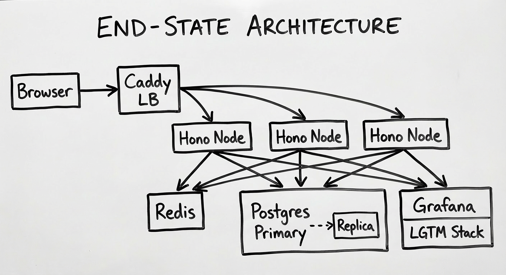

## Systems Design for Full-Stack Developers
Have you ever read an article about systems design and felt totally lost when they were talking about L7 load balancing, LRU caches, failover, p99? You're not alone.

Hi, I'm Rasheed. I've been a software engineer for over ten years, and I've learned a lot about how to build maintainable web applications for companies of all sizes. But as I discovered on a Google interview once, I don't know how to design scalable software. The question I was asked was -- "How would you design the Google search bar?" Apparently the answer was NOT "use an input form and call GET google.com/search!"

That interview has stuck with me even more than five years later, but I never got around to actually studying systems design and scalable software. Now, in the spirit of building, learning, and teaching, I'm building a classic interview question: a URL shortener. I'm sharing my journey with you.

Most infrastructure content teaches concepts in isolation. You may have read about caching, but you've never actually watched a cache miss fall back to the database and seen the latency difference. This series is about closing that gap.

We have two endpoints:

```
POST /shorten   — takes a URL, returns a slug
GET  /:slug     — redirects to the original URL
```

That's the whole thing. It's intentionally trivial — because the point isn't the app, it's what we layer on top of it.

Each phase introduces one infrastructure concept, builds it on a real VPS, and measures the result. The baseline from Phase 1 carries through every subsequent post. By the end, the same two-endpoint app will have Redis caching, rate limiting, horizontal scaling across multiple nodes, and full observability with the Grafana LGTM stack.

This series does not require any prior infrastructure knowledge. The fun part about infrastructure is that it's largely separate from your backend code, so the concepts apply whether your backend is Java, Python, Rails, or anything else.

That being said, the base application will be built using Node.js, but we won't really be updating application code too much so if you aren't familiar with Node.js, don't fret.

At the end of the series, if you've followed along, you'll have built a fully scalable URL shortener and understand what problem each concept solves. More importantly, you'll have measured the performance gains concretely on real production infrastructure.

## What we're building



| Phase | Concept | What gets added |
|-------|---------|-----------------|
| 1 | Baseline | Hono + Postgres + Swagger, deployed on a single VPS |
| 2 | Caching | Redis cache-aside on the redirect path |
| 3 | Rate limiting | Redis-backed sliding window on POST /shorten |
| 4 | Horizontal scaling | Second VPS, shared state, stateless design |
| 5 | Observability | Prometheus, Loki, Tempo, Grafana |
| 6 | Replication | Postgres read replica, read/write splitting, chaos |

## A note on the code

Code in this series is AI-scaffolded — boilerplate, schema definitions, middleware, Docker Compose wiring. Everything I publish is something I've read, understood, and can explain. All latency measurements, configuration decisions, and failure observations come from running this on a real Hetzner VPS.

Each post includes a disclosure to that effect.

I will be using Alex Xu's [System Design Interview book](https://www.amazon.com/System-Design-Interview-insiders-Second-ebook/dp/B08B3FWYBX?_encoding=UTF8&qid=&sr=) as a reference in this series.

If you want to follow along, [here](https://github.com/abustamam/url-shortener) is the repo.

Let's learn together!