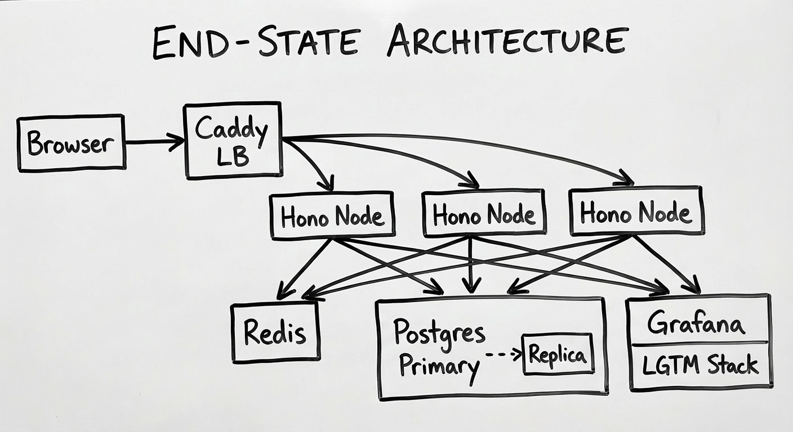

## Systems Design for Full-Stack Developers

Most infrastructure content teaches concepts in isolation. Reading about caching is not the same as watching a cache miss fall back to the database and measuring the latency difference. This series closes that gap.

The vehicle is a URL shortener — a classic interview question that most developers underestimate. Two endpoints, one database table, and a load test. From that minimal foundation, each phase layers on one infrastructure concept, builds it on a real VPS, and measures the result.

The baseline from Phase 1 carries through every subsequent post. By the end, the same two-endpoint app has Redis caching, rate limiting, horizontal scaling across multiple nodes, and full observability with the Grafana LGTM stack.

The app has two endpoints:

```
POST /shorten   — takes a URL, returns a slug
GET  /:slug     — redirects to the original URL
```

That is the entire surface area. The app is intentionally trivial — because the point is not the app, it is what gets layered on top of it.

No prior infrastructure knowledge is required. Infrastructure is largely separate from backend code, so the concepts apply whether the backend is Java, Python, Rails, or anything else. The base application uses Node.js, but application code changes are minimal.

By the end of the series, the result is a fully scalable URL shortener with concrete performance measurements on real production infrastructure — and a clear understanding of what problem each concept solves.

## What This Series Builds



| Phase | Concept | What gets added |
|-------|---------|-----------------|
| 1 | Baseline | Hono + Postgres + Swagger, deployed on a single VPS |
| 2 | Caching | Redis cache-aside on the redirect path |
| 3 | Rate limiting | Redis-backed sliding window on POST /shorten |
| 4 | Horizontal scaling | Second VPS, shared state, stateless design |
| 5 | Observability | Prometheus, Loki, Tempo, Grafana |
| 6 | Replication | Postgres read replica, read/write splitting, chaos |

## A note on the code

Code in this series is AI-scaffolded — boilerplate, schema definitions, middleware, Docker Compose wiring. Everything published has been read, understood, and can be explained in detail. All latency measurements, configuration decisions, and failure observations come from running this on a real Hetzner VPS.

Each post includes a disclosure to that effect.

Alex Xu's [System Design Interview book](https://www.amazon.com/System-Design-Interview-insiders-Second-ebook/dp/B08B3FWYBX?_encoding=UTF8&qid=&sr=) is used as a reference throughout the series.

The repo is available [here](https://github.com/abustamam/url-shortener).