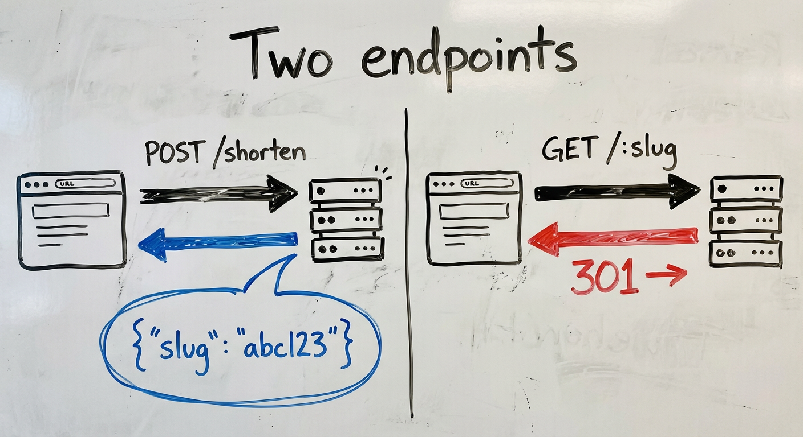
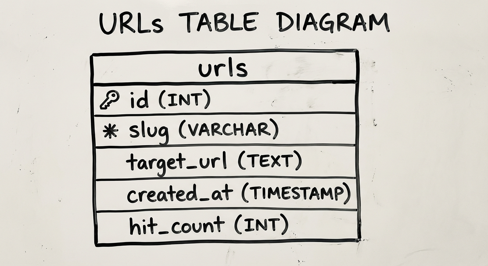
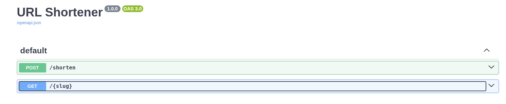
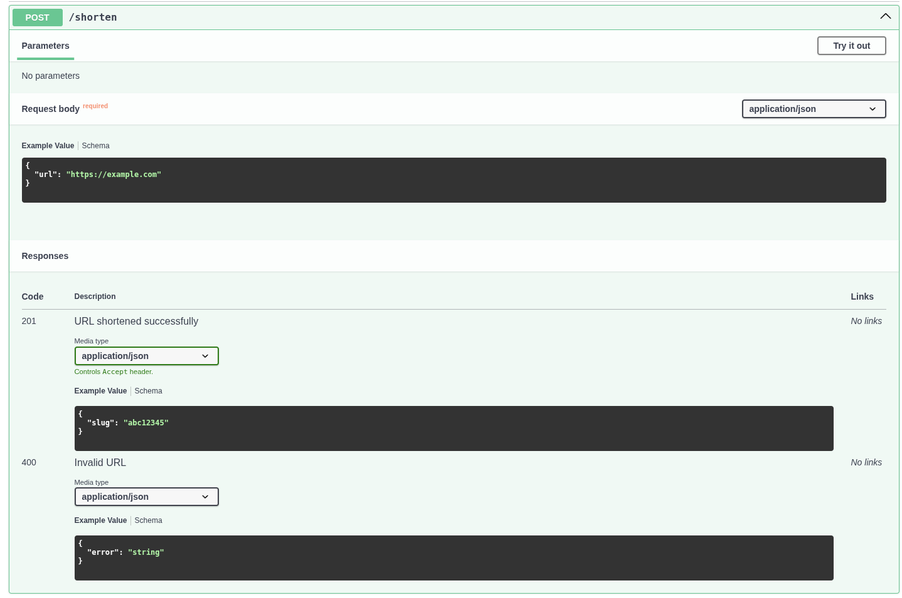
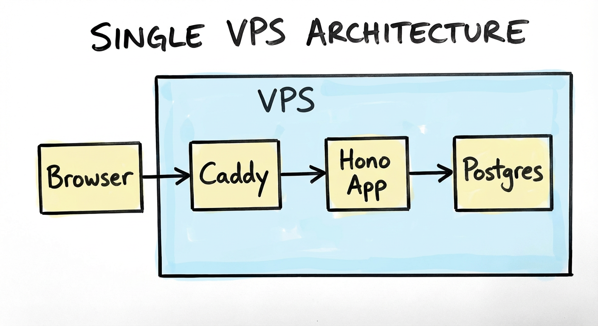
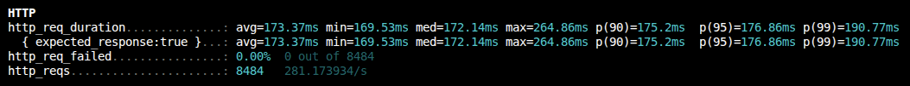
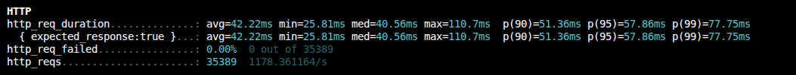

> *Disclaimer: I used AI to scaffold the implementation. All measurements, configuration decisions, and failure observations are from running this on a real VPS.*

---

*TL;DR*: A minimal Hono + Postgres URL shortener with two endpoints and Swagger UI. This post establishes the baseline latency that serves as the reference point for the entire series.

Interview question: "Design a URL shortener."

That is the entire prompt. The common answer — "two endpoints, one to shorten, one to redirect" — misses the point. This is a weeder question, not a trick question. The trap is underestimating the complexity. Two endpoints and a single database table are not enough for production. A million requests per day against a 1 vCPU VPS does not end well without deliberate design decisions.

This series teaches infrastructure concepts hands-on — by building something real, measuring it, and breaking it. A URL shortener is the perfect vehicle: trivial enough to understand in five minutes, interesting enough to layer complexity onto.

This first post covers the foundation. No Redis, no load balancers, nothing clever. Just the app itself, and a baseline p95 that every subsequent phase compares against.

The repo is available [here](https://github.com/abustamam/url-shortener).

## The app in two endpoints

```
POST /shorten   — takes a URL, returns a slug
GET  /:slug     — looks up the slug, redirects to the original URL
```

That is the entire surface area. This series makes these two endpoints faster, more resilient, and more observable. Keeping the app trivial is intentional — it isolates each concept so the infrastructure change is the only variable.



## Why Hono

The stack choice is deliberate: the app is not the point. Hono is the simplest serverside framework that provides OpenAPI specs. It runs on any JS runtime — Node, Bun, Cloudflare Workers, Deno. For this project, two features matter:

1. **First-class TypeScript** — no ceremony, no workarounds
2. **`@hono/zod-openapi`** — schema validation and OpenAPI spec generation from the same source

That second point matters — more on that shortly.

## Schema design

The database has one table, codified here as a drizzle schema:

```ts
import { pgTable, serial, text, timestamp, integer, index } from 'drizzle-orm/pg-core'

export const urls = pgTable('urls', {
  id: serial('id').primaryKey(),
  slug: text('slug').notNull().unique(),
  originalUrl: text('original_url').notNull(),
  createdAt: timestamp('created_at').defaultNow().notNull(),
  hitCount: integer('hit_count').default(0).notNull(),
}, (table) => [
  index('slug_idx').on(table.slug),
])
```

The `hitCount` column tracks how often a link is accessed. More on its role in the implementation section.

One other decision worth noting: slug has a UNIQUE constraint, so the database enforces no collisions. The application layer doesn't need to worry about it.



## Slug generation: three approaches

There are three common ways to generate slugs, each with different tradeoffs:

| Approach | Example | Pros | Cons |
|----------|---------|------|------|
| **Random (nanoid)** | `gV5kXp` | No coordination needed, unpredictable | Slightly longer for the same collision resistance |
| **Hash of URL** | `sha256(url)[:7]` | Deterministic — same URL, same slug | Hash collisions require handling; leaks URL structure |
| **Sequential** | `0001`, `0002` | Short, predictable length | Requires coordination; enumerable (privacy concern) |

The choice: nanoid (random). Sequential slugs are a privacy concern — a short URL ending in 00100 invites enumeration of 00001-00099. Hash vs random was close, but random had fewer downsides. The correct choice depends on whether leaking the URL structure is acceptable.

A 7-character slug from a 36-character alphabet (a-z and 0-9) gives you ~78 billion possible combinations. At a million slugs created per day, you'd expect your first collision after roughly 200 years. This is why observability matters — if a collision happens, the data shows when and how frequently, enabling a reassessment of random vs hash vs longer random slugs. An 8-character slug provides 2.8 trillion combos. This post uses nanoid 8, though nanoid 7 would suffice.

## OpenAPI as documentation-as-code

`@hono/zod-openapi` lets you define your request/response schemas once, and get two things for free: **runtime validation** and **an OpenAPI spec**. The Swagger UI at `/docs` becomes your interactive frontend, no separate frontend needed.

```ts
const shortenRoute = createRoute({
  method: 'post',
  path: '/shorten',
  request: {
    body: {
      content: {
        'application/json': {
          schema: z.object({ url: z.string().url() }),
        },
      },
    },
  },
  responses: {
    201: {
      content: {
        'application/json': {
          schema: z.object({ slug: z.string() }),
        },
      },
      description: 'URL shortened successfully',
    },
  },
});
```
API providers that ship interactive playgrounds make integration easier — schema visibility and test execution without touching code. The result is a clean, self-documenting view of every endpoint, including usage guidance, deprecation status, and auth requirements.




## The full endpoints

Here's the full implementation of the URL shortener. The only non-obvious decision is in `redirect.ts`: hit count tracking is fire-and-forget, so a slow or failed counter update never delays the redirect. This is fine for our low-scale demo as a baseline, because the redirect matters more than the counter.

The `/redirect` endpoint:

```ts
import { createRoute, z } from '@hono/zod-openapi'
import { OpenAPIHono } from '@hono/zod-openapi'
import { eq, sql } from 'drizzle-orm'
import { db } from '../db'
import { urls } from '../db/schema'

const SlugParamSchema = z.object({
  slug: z.string().openapi({ example: 'abc12345' }),
})

const ErrorSchema = z.object({
  error: z.string(),
})

const redirectRoute = createRoute({
  method: 'get',
  path: '/{slug}',
  request: {
    params: SlugParamSchema,
  },
  responses: {
    301: {
      description: 'Redirect to the original URL',
    },
    404: {
      content: { 'application/json': { schema: ErrorSchema } },
      description: 'Slug not found',
    },
  },
})

export const redirectRouter = new OpenAPIHono()

redirectRouter.openapi(redirectRoute, async (c) => {
  const { slug } = c.req.valid('param')

  const result = await db
    .select()
    .from(urls)
    .where(eq(urls.slug, slug))
    .limit(1)

  if (result.length === 0) {
    return c.json({ error: 'Slug not found' }, 404)
  }

  // Fire-and-forget: increment hit count without blocking the redirect
  db.update(urls)
    .set({ hitCount: sql`${urls.hitCount} + 1` })
    .where(eq(urls.slug, slug))
    .execute()
    .catch(() => {}) // swallow errors — redirect is more important than the counter

  return c.redirect(result[0].originalUrl, 301)
})
```

The `/shorten` endpoint is a lot simpler. No fire-and-forget, just insert the record and return the slug.

```ts
import { createRoute, z } from '@hono/zod-openapi'
import { OpenAPIHono } from '@hono/zod-openapi'
import { nanoid } from 'nanoid'
import { db } from '../db'
import { urls } from '../db/schema'

const ShortenBodySchema = z.object({
  url: z.string().url().openapi({ example: 'https://example.com' }),
})

const ShortenResponseSchema = z.object({
  slug: z.string().openapi({ example: 'abc12345' }),
})

const ErrorSchema = z.object({
  error: z.string(),
})

const shortenRoute = createRoute({
  method: 'post',
  path: '/shorten',
  request: {
    body: {
      content: { 'application/json': { schema: ShortenBodySchema } },
      required: true,
    },
  },
  responses: {
    201: {
      content: { 'application/json': { schema: ShortenResponseSchema } },
      description: 'URL shortened successfully',
    },
    400: {
      content: { 'application/json': { schema: ErrorSchema } },
      description: 'Invalid URL',
    },
  },
})

export const shortenRouter = new OpenAPIHono()

shortenRouter.openapi(shortenRoute, async (c) => {
  const { url } = c.req.valid('json')
  const slug = nanoid(8)

  await db.insert(urls).values({ slug, originalUrl: url })

  return c.json({ slug }, 201)
})
```

This app is intentionally simple. The complexity emerges at scale — the focus of the rest of this series.

## Deployment: single VPS behind Caddy

The deployment is intentionally simple: one Hetzner VPS, Caddy as a reverse proxy. Caddy handles TLS automatically. The app runs in a Docker container.

The deployment uses a 4vCPU / 8GB RAM Ubuntu box in a Helsinki datacenter ($5.99/mo) — the standard lab setup. Smaller instances may work; scale up if needed.

Docker Compose manages the services. The `docker-compose.yml`:

```yml
services:
  postgres:
    image: postgres:16
    container_name: postgres
    environment:
      POSTGRES_USER: ${POSTGRES_USER:-postgres}
      POSTGRES_PASSWORD: ${POSTGRES_PASSWORD}
      POSTGRES_DB: ${POSTGRES_DB:-urlshortener}
    command:
      - "-c"
      - "shared_preload_libraries=pg_stat_statements"
      - "-c"
      - "pg_stat_statements.track=all"
      - "-c"
      - "pg_stat_statements.max=10000"
      - "-c"
      - "track_io_timing=on"
    volumes:
      - ./db-metadata-postgres/data:/var/lib/postgresql/data
      - ./db-metadata-postgres/backups:/backups
    healthcheck:
      test: ["CMD-SHELL", "pg_isready -U ${POSTGRES_USER:-postgres}"]
      interval: 10s
      timeout: 5s
      retries: 5
      start_period: 10s
    restart: unless-stopped

  url-shortener:
    image: ghcr.io/abustamam/url-shortener2:latest
    container_name: url-shortener
    environment:
      DATABASE_URL: postgresql://${POSTGRES_USER:-postgres}:${POSTGRES_PASSWORD}@postgres:5432/urlshortener
      PORT: 8082
    ports:
      - "8082:8082"
    depends_on:
      postgres:
        condition: service_healthy
    restart: unless-stopped

  caddy:
    image: caddy
    container_name: caddy
    ports:
      - "80:80"
      - "443:443"
    volumes:
      - ./Caddyfile:/etc/caddy/Caddyfile
      - ./caddy/data:/data
    depends_on:
      - url-shortener
    restart: unless-stopped

networks:
  default:
    name: srv-network
```

Use a `.env` to override `POSTGRES_USER`, `POSTGRES_PASSWORD`, and `POSTGRES_DB` from the defaults.

The `Caddyfile`:

```Caddyfile
shrtn.bustamam.tech {
    reverse_proxy url-shortener:8082
}
```



A single-node setup is exactly right for Phase 1. It makes the baseline latency measurement meaningful — there's no load balancer, no network hops between services, nothing to confuse the numbers.

## Measuring the baseline

First: measure redirect latency. These values are referenced in every subsequent phase, and every optimization compares against them.

Baseline values come from load-testing, then computing statistical latencies — commonly called p50, p90, p95, p99. In p*n*, *n* is the percentile. The math is simple: sort the values, then grab the entry at the specified rank. p50 is the 50% mark — half lower, half higher. p99 is the highest 1% of latencies, and that is where optimization time is best spent. 1% of 100 is 1, but 1% of 100,000 is 1,000. Those are real users experiencing real latency.

k6 was chosen because it natively outputs p50/p95/p99 in its summary, and it is scriptable in JS.

I wrote this script:

```js
/**
 * k6 load test for the URL shortener.
 *
 * Usage:
 *   k6 run --env BASE_URL=https://yourdomain.com --env SLUG=abc123 scripts/load-test.js
 *
 * Optional env vars:
 *   VUS       — number of virtual users (default: 50)
 *   DURATION  — test duration (default: 30s)
 *
 * At the end of the run k6 prints a summary including p50/p95/p99 for
 * http_req_duration. Copy those numbers into your blog post / phase notes.
 */

import http from 'k6/http';
import { check } from 'k6';

const BASE_URL = __ENV.BASE_URL || 'http://localhost:3000';
const SLUG = __ENV.SLUG;

if (!SLUG) {
  throw new Error('Set --env SLUG=<your-slug> before running');
}

export const options = {
  vus: parseInt(__ENV.VUS || '50', 10),
  duration: __ENV.DURATION || '30s',
  summaryTrendStats: ['avg', 'min', 'med', 'max', 'p(90)', 'p(95)', 'p(99)'],
};

export default function () {
  const res = http.get(`${BASE_URL}/${SLUG}`, { redirects: 0 });
  check(res, { 'status is 301 or 302': (r) => r.status === 301 || r.status === 302 });
}
```

`vus` represents "virtual users." This script simulates 50 parallel users continuously looping for 30 seconds. Each VU makes one request, then immediately makes another upon receiving a response.

Install k6 from [the official docs](https://grafana.com/docs/k6/latest/set-up/install-k6/?pg=get&plcmt=selfmanaged-box10-cta1).

Create a test slug via `/shorten` and note the slug.

Then run:
```bash
k6 run --env BASE_URL="https://shrtn.your.domain" --env SLUG="your_slug" scripts/k6-baseline.js
```

Focus on `http_req_duration` — the time from sending the request to receiving the response. `iteration_duration` includes k6 overhead per iteration. 



| Percentile | Latency |
|------------|---------|
| p50 (med) | 172.14ms |
| p95 | 176.86ms |
| p99 | 190.77ms |

The distribution is pretty tight! 19ms between p50 and p99. The 170ms is almost certainly dominated by network round-trip to Helsinki, not app time.

To isolate network latency from app latency, run the same test directly on the Hetzner box.



| Percentile | Latency |
|------------|---------|
| p50 (med) | 40.56ms |
| p95 | 57.86ms |
| p99 | 77.75ms |

The on-box test saves ~120ms of round-trip latency. Next: profile the Postgres query directly.

```bash
docker compose exec postgres   psql -U "${POSTGRES_USER:-postgres}" urlshortener   -c "EXPLAIN ANALYZE SELECT original_url FROM urls WHERE slug = 'WY3Ly9Yd';"
                                                   QUERY PLAN                                                    
-----------------------------------------------------------------------------------------------------------------
 Bitmap Heap Scan on urls  (cost=4.14..8.15 rows=1 width=20) (actual time=0.029..0.030 rows=1 loops=1)
   Recheck Cond: (slug = 'WY3Ly9Yd'::text)
   Heap Blocks: exact=1
   ->  Bitmap Index Scan on slug_idx  (cost=0.00..4.14 rows=1 width=0) (actual time=0.012..0.012 rows=1 loops=1)
         Index Cond: (slug = 'WY3Ly9Yd'::text)
 Planning Time: 0.419 ms
 Execution Time: 0.091 ms
(7 rows)
```

Planning time is what Postgres spends optimizing the query. Execution time is what it spends running it.

Absolute numbers matter less than having a baseline. Every subsequent phase changes something about the system, and the comparison against this baseline reveals whether the change helped or hurt.

The Postgres query executes in 0.091ms — Postgres is not the bottleneck. The ~40ms on the VPS is the full request pipeline: Caddy, Docker networking, Hono, connection pool to Postgres, etc.

## What's next

Phase 2 adds Redis. Every redirect currently hits Postgres, but a redirect is a pure read, and the slug-to-URL mapping almost never changes. It is the ideal cache candidate. To reiterate: the goal is not query speed optimization — the query is already sub-millisecond. The purpose is to eliminate *unnecessary* queries.

Before any optimization: measure. The baseline established here is the only honest way to know whether the next change actually helped.

> You can't manage what you don't measure.

---

*Disclaimer: I used AI to scaffold the implementation. All measurements, configuration decisions, and failure observations are from running this on a real VPS.*
