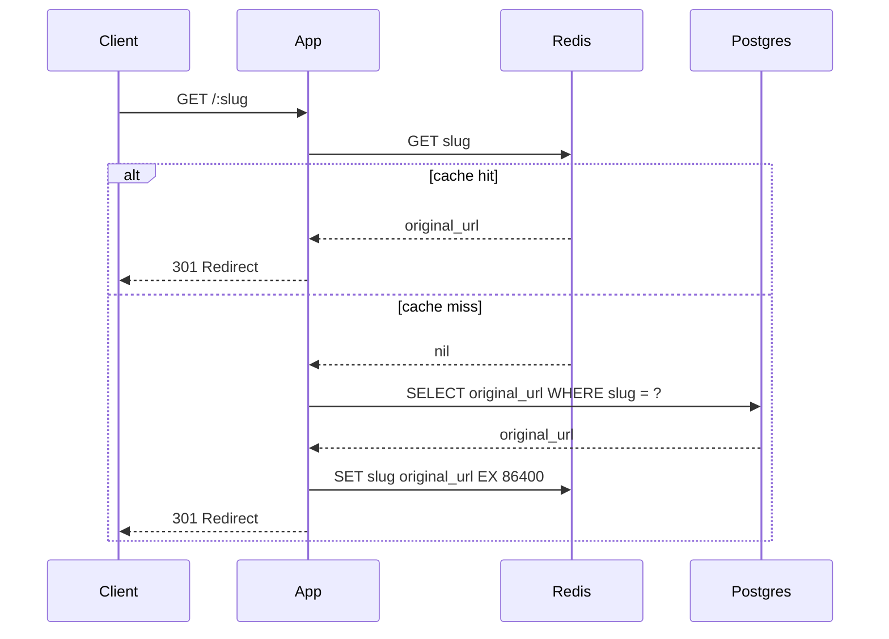

> *Disclaimer: I used AI to scaffold the implementation. All measurements, configuration decisions, and failure observations are from running this on a real VPS.*

---

## TL;DR
Redirects are pure reads: a slug maps to a URL and that mapping almost never changes. We already measured our Postgres query to be sub-millisecond. Caching won't make this faster, but it will prevent an unnecessary DB hit. The interesting work here isn't necessarily the cache, it's deciding what TTL to use and what to do if a URL gets deleted.

**Who this is for:** This post assumes you've read [Post 1](/writing/url-shortener-phase-1-baseline/) or are already running a working Hono + Postgres URL shortener. No prior Redis experience required — we'll cover what you need.

*New in this phase: ioredis 5.3.2*

## Intro

Adding a cache is the easy part. The hard part is deciding what to do when the underlying data changes. As we previously saw, a URL shortener is simple, and even here cache invalidation requires real decisions.

---

## Why Redirects Are Perfect Cache Candidates

Before reaching for Redis, it's worth being explicit about why this particular endpoint benefits from a cache.

`GET /:slug` is a pure read. Given the same slug, it returns the same URL — always. The underlying data almost never changes after creation. And the read-to-write ratio is heavily skewed: for every `POST /shorten`, there are potentially thousands of `GET /:slug` hits.

That's the ideal cache candidate profile: **read-heavy, write-rare, frequently queried with the same key**.

A cache miss here costs one Postgres query — cheap, but not free. A cache hit costs one Redis lookup — nearly free.

Contrast this with `POST /shorten`: every shorten is a new record. There's no "cache" for a write — it always needs the database. We won't cache that endpoint.

---

## The Cache-Aside Pattern

There are several ways to integrate a cache with a database. We're using **cache-aside** (also called lazy loading):

1. Check Redis for the slug key
2. On a **hit**: return the cached URL immediately — no database query
3. On a **miss**: query Postgres, populate the cache with a TTL, return the URL



The alternative is **write-through**: populate the cache on every write, so the cache is always warm. We're not using it here because writes are rare — there's no benefit to pre-populating an entry that might never be read again.

### The Redis client

```typescript
// src/lib/redis.ts
import { Redis } from 'ioredis'

const redis = new Redis(process.env.REDIS_URL ?? 'redis://127.0.0.1:6379')

redis.on('error', (err) => {
  console.error({ msg: 'Redis connection error', err })
})

export { redis }
```

A singleton client. The error handler prevents unhandled rejections from crashing the process — Redis connection drops happen in production, and they shouldn't take down the app.

### The updated `GET /:slug` handler

```typescript
// src/routes/redirect.ts
import { getCached, setCached } from '../lib/redis'

redirectRouter.openapi(redirectRoute, async (c) => {
  const { slug } = c.req.valid('param')
  const ttl = Number(process.env.CACHE_TTL_SECONDS ?? 86400)

  // Check cache first — fail-open: if Redis is unavailable, fall through to Postgres
  let cached: string | null = null
  try {
    cached = await getCached(slug)
  } catch {
    // Redis unavailable — proceed with Postgres fallback
  }

  if (cached) {
    // Fire-and-forget hit count increment (same as cold path — doesn't block redirect)
    db.update(urls)
      .set({ hitCount: sql`${urls.hitCount} + 1` })
      .where(eq(urls.slug, slug))
      .execute()
      .catch(() => {})

    return c.redirect(cached, 301)
  }

  // Cache miss — query Postgres
  const result = await db
    .select()
    .from(urls)
    .where(eq(urls.slug, slug))
    .limit(1)

  if (result.length === 0) {
    return c.json({ error: 'Slug not found' }, 404)
  }

  const { originalUrl } = result[0]

  // Populate cache — fire-and-forget so a Redis write failure doesn't block the redirect
  setCached(slug, originalUrl, ttl).catch(() => {})

  // Fire-and-forget hit count
  db.update(urls)
    .set({ hitCount: sql`${urls.hitCount} + 1` })
    .where(eq(urls.slug, slug))
    .execute()
    .catch(() => {})

  return c.redirect(originalUrl, 301)
})
```

A few notes on the handler:

**On a cache hit, we still increment `hit_count`.** The counter lives in Postgres and is incremented regardless of whether Redis served the response. The two systems are tracking different things: Redis tracks the URL, Postgres tracks the usage.

**`CACHE_TTL_SECONDS` is an env var.** The right TTL depends on your use case. We'll discuss how to choose it in the next section.

**The cold path is now two round trips** (Redis + Postgres) instead of one. In practice Redis responds in <1ms, so this adds negligible overhead. But it's worth knowing — a "cache miss" with Redis is technically slower than no cache at all on that first request.

### Docker Compose changes

Before these code changes actually work in production, you need to run Redis somewhere. Add it to `docker-compose.yml`:

```yaml
services:
  redis:
    image: redis:7-alpine
    container_name: redis
    restart: unless-stopped

  url-shortener:
    # ... existing config ...
    environment:
      DATABASE_URL: postgresql://${POSTGRES_USER:-postgres}:${POSTGRES_PASSWORD}@postgres:5432/urlshortener
      PORT: 8082
      REDIS_URL: redis://redis:6379    # <-- add this
    depends_on:
      - postgres
      - redis                        # <-- add this
```

Docker Compose's internal DNS resolves `redis` to the container IP. The `REDIS_URL` env var overrides the `127.0.0.1` default in the code.

**A gotcha that cost me an hour:** I added the Redis code, rebuilt the image, pushed it, and eagerly ran k6. The numbers were *worse* than Phase 1. I checked Redis directly: every `GET "slug:..."` returned `(nil)`. The cache was never being written. The problem? I had updated the code but never added the `redis` service to `docker-compose.yml` on the VPS. The old image was still running, the app was trying to connect to `127.0.0.1:6379` inside its container, failing silently, and falling back to Postgres — plus paying the connection-timeout tax.

**Adding code isn't deploying it.** Verify with:

```bash
docker compose exec redis redis-cli GET "slug:your-slug"
```

If it returns `(nil)` after a request, your app isn't talking to Redis.

---

## The TTL Decision

TTL is the first real design decision in this phase. There's no universally correct answer — it depends on what you're optimizing for.

**Short TTL (minutes):** Frequent cache misses, more Postgres load, but stale data clears quickly. Good if URLs change often.

**Long TTL (hours/days):** Few cache misses, minimal Postgres load, but stale data lingers. Fine if URLs are immutable after creation.

For a URL shortener where slugs are created once and never modified, a long TTL is defensible. We're using 24 hours (`86400` seconds) as a starting point.

### What "stale" actually means

A cached slug becomes stale when the underlying record changes — either the `original_url` is updated, or the record is deleted entirely. For a URL shortener:

- **Updates are rare.** Most implementations don't allow updating a slug's destination. If yours does, you need to invalidate on update.
- **Deletions happen.** If you delete a URL from Postgres but don't invalidate Redis, the cache will serve a redirect for up to `CACHE_TTL_SECONDS` to a URL that no longer exists in your system.

The fix is to `DEL` from Redis whenever you delete from Postgres:

```typescript
// src/routes/shorten.ts (delete handler — you may not have this yet)
async function deleteSlug(slug: string) {
  await db.delete(urls).where(eq(urls.slug, slug))
  await redis.del(slug)   // evict from cache
}
```

I haven't built a delete endpoint yet — for now, a deleted slug would keep redirecting until the TTL expires. That's a known deferral. In practice, if you don't offer deletion, this edge case never fires. But it's worth knowing that "we don't have deletes" is a decision, not an absence of a feature.

This is why cache invalidation has a reputation. It's not the TTL math that's hard — it's identifying all the places where the underlying data can change.

---

## Before and After

> **Redis caching reduced on-server redirect latency by ~70%.** p50 went from 40.56ms → 11.26ms; p95 from 57.86ms → 19.55ms; p99 from 77.75ms → 25.39ms. The warm path is purely Redis — no database roundtrip at all.

But a hidden cost emerged. When measuring from outside the VPS, tail latency got worse: p99 jumped from 191ms to 286ms. The p50 stayed flat, which means network RTT to Helsinki still dominates for most requests. The p99 spike comes from somewhere else.

### Methodology

Use the same k6 script from Phase 1, but pre-warm the cache first so you're testing cache hits:

```bash
# 1. Warm the cache (must return 301)
curl -I https://shrtn.bustamam.tech/WY3Ly9Yd

# 2. Verify it's warm
docker compose exec redis redis-cli GET "slug:WY3Ly9Yd"

# 3. Run k6
k6 run --env BASE_URL="https://shrtn.bustamam.tech" --env SLUG="WY3Ly9Yd" scripts/k6-baseline.js
```

Run k6 twice: once from your local machine (includes network RTT) and once from inside the VPS (app latency only).

### Results

| Metric | Phase 1 (no cache) | Phase 2 (Redis, local k6) | Phase 2 (Redis, on-VPS k6) |
|--------|-------------------|---------------------------|---------------------------|
| p50 | 172.14ms | 176.56ms | **11.26ms** |
| p95 | 176.86ms | 192.53ms | **19.55ms** |
| p99 | 190.77ms | 286.36ms | **25.39ms** |
| throughput | 234 req/s | 269 req/s | **4,253 req/s** |

The on-VPS numbers are the real story: **Redis cut server-side latency by ~70% and increased throughput 18x.** The 11ms p50 is Hono + Redis + Docker networking overhead — no Postgres involved.

### The p99 anomaly

The p99 from outside the VPS got worse (190ms → 286ms). At first glance this is surprising — the cache hit should be faster. But looking at the code, on every cache hit we still fire a `hitCount` UPDATE to Postgres:

```typescript
if (cached) {
  // Fire-and-forget hit count increment (same as cold path — doesn't block redirect)
  db.update(urls)
    .set({ hitCount: sql`${urls.hitCount} + 1` })
    .where(eq(urls.slug, slug))
    .execute()
    .catch(() => {})

  return c.redirect(cached, 301)
}
```

The `.catch(() => {})` makes this fire-and-forget from the app's perspective — the redirect returns without waiting for the UPDATE to complete. But from Postgres's perspective, 50 concurrent requests all trying to increment the same row still create **write-lock contention**. The `.catch()` doesn't prevent the database from having to acquire the lock, increment the counter, and write the WAL. Some requests get unlucky and queue behind others.

This is why p50 stays flat (most requests win the lock race quickly) but p99 spikes (the unlucky ones wait). That's the signature of row-lock contention: most requests are fine, but the unlucky ones queue up behind a locked row.

For a production system, the real fix is either removing hit counts on cache hits (accept under-counting) or moving them to a Redis counter flushed periodically. For this series, the lesson to take home: **fire-and-forget doesn't mean free**. The database still does the work, and concurrent writes to the same row still contend.

### Cache hit rate

After running the load test:

```bash
redis-cli INFO stats | grep -E "keyspace_hits|keyspace_misses"
# keyspace_hits:127685
# keyspace_misses:1
```

Hit rate: **99.999%** — the single miss was the pre-warm curl. Under real traffic with many slugs, the rate depends on your TTL and access patterns.

To verify the TTL was set correctly:

```bash
redis-cli TTL "slug:WY3Ly9Yd"    # returns remaining seconds; -1 means no TTL; -2 means key doesn't exist
```

---

## Trade-offs

Redis is now a dependency. If Redis goes down, the cache is unavailable — but the app should still function by falling back to Postgres on every request. The error handler on the Redis client above prevents a connection error from crashing the process, but the redirect handler itself will throw if `redis.get()` rejects.

A production-grade implementation would wrap Redis calls in a try/catch and fall back to Postgres on Redis failure. I implemented this — the redirect handler uses `getCached()` which catches Redis errors and returns `null`, triggering the Postgres fallback. The app treats Redis as a **soft dependency**: nice to have, not required. If Redis is down, every request becomes a cache miss and hits Postgres directly. The app still works; it's just slower.

```typescript
// Cache-resilient lookup — degrades gracefully if Redis is unavailable
let cached: string | null = null
try {
  cached = await getCached(slug)
} catch {
  // Redis unavailable — proceed with Postgres fallback
}
```

---

## Closer

That's Phase 2. The cache works, the numbers are real, and I now know what "cache invalidation is hard" actually means. Next phase: someone's about to start hammering `POST /shorten`. Time to add rate limits — and the algorithm choice matters more than you'd expect.

---

## Further Reading

- [Redis documentation: Caching patterns](https://redis.io/docs/manual/patterns/)
- [ioredis documentation](https://github.com/redis/ioredis)
- Alex Xu — *System Design Interview*, Ch. 6 (Design a Key-Value Store)
- *Designing Data-Intensive Applications*, Ch. 1 — on caching and the cost of consistency
