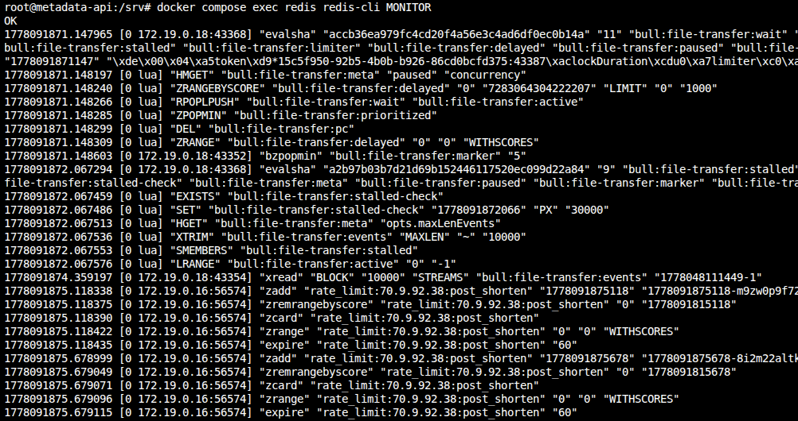
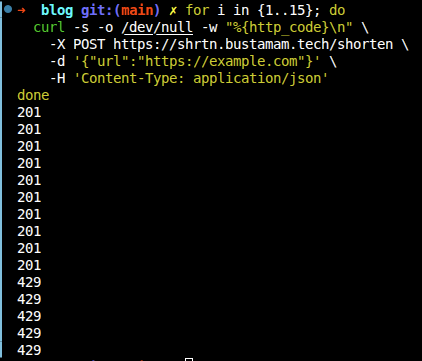
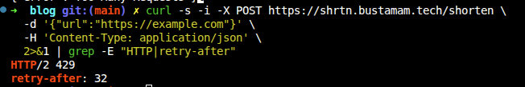
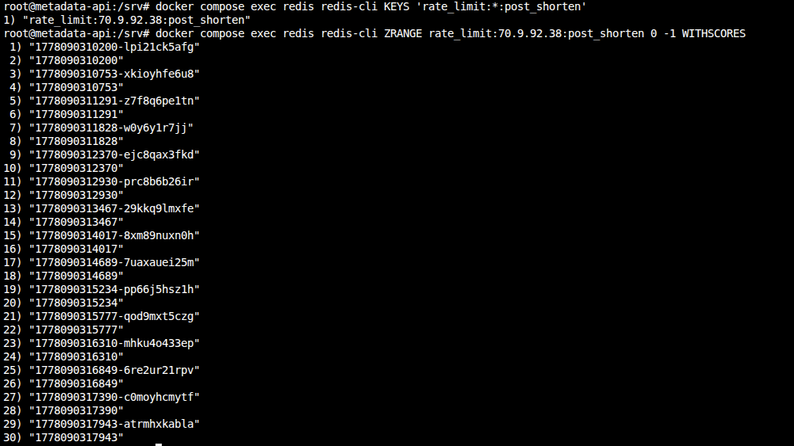

> *Disclaimer: I used AI to scaffold the implementation. All measurements, configuration decisions, and failure observations are from running this on a real VPS.*

---

## TL;DR

Rate limiting prevents someone from hitting your API 100 times in a second and racking up costs or crashing your server. In this post we'll add sliding window rate limiting to the `/shorten` endpoint using Redis — the same Redis instance already running from Phase 2.

**Who this is for:** You've followed the series or have a Hono app with Redis running. Read [post 2](/writing/url-shortener-phase-2-caching/) if you need to catch up. No prior rate limiting knowledge needed. Code is [here](https://github.com/abustamam/url-shortener/tree/v3-rate-limiting).

*No new dependencies — Redis is already running from Phase 2.*

## Intro

"Add rate limiting" sounds like a one-liner. It isn't. I spent more time deciding which algorithm to use than writing the actual Redis code.

---

## The Three Algorithms

I looked at three approaches. Two of them were wrong for this project.

### Fixed Window

The simplest approach: count requests per IP in a time bucket, reset the counter at the start of each new bucket.

```
minute 0 [00:00 - 00:59]  → 8 requests  → allowed (limit: 10)
minute 1 [01:00 - 01:59]  → 8 requests  → allowed
```

Redis implementation is two operations: `INCR key` and `EXPIRE key window_seconds`.

**The problem:** the window boundary is exploitable.

```
00:59 → 10 requests   (limit reached for minute 0)
01:00 → 10 requests   (new minute, counter resets)
```

That's 20 requests in 2 seconds — double the stated limit. You can hit this just by timing requests around the boundary. I didn't want to ship something that obvious.

### Sliding Window

Sliding window fixes the boundary exploit by counting requests relative to *now*, not relative to a fixed clock boundary.

Instead of "how many requests in the current minute," it asks "how many requests in the last 60 seconds from this moment."

```
now = 01:30
window = 60s
→ count requests between 00:30 and 01:30
→ the boundary is always moving — there's no single reset moment to exploit
```

Redis implementation uses a sorted set: timestamps as both the score and the member value. On each request:
1. Add current timestamp to the set
2. Remove entries older than `now - window`
3. Count what remains
4. If count > limit, reject

Slightly more memory and CPU than fixed window — each IP has a sorted set of timestamps rather than a single counter. At the scale of this project, that cost is negligible.

### Token Bucket

Token bucket allows bursts — if you haven't made requests in 5 seconds, you can make 5 back-to-back. That's great for APIs with bursty legitimate traffic. But `POST /shorten` isn't one of those. No one needs to create 10 URLs in one second. Token bucket also has trickier race conditions; you need to track token count and last refill time atomically. I skipped it.

---

## Why Sliding Window for This App

`POST /shorten` is a spam target. I wanted strict limits, not graceful burst tolerance. Sliding window fits because the boundary isn't exploitable, the behavior is easy to reason about ("you made N requests in the last 60 seconds"), and Redis sorted sets make it straightforward to implement.

Here's what actually hits Redis when a request comes through. I ran `MONITOR` and called `/shorten`:



You can see the five commands in order: `ZADD` the timestamp, `ZREMRANGEBYSCORE` to evict old entries, `ZCARD` to count what's left, `ZRANGE` to find the oldest entry for `Retry-After`, and `EXPIRE` to set the TTL. All in one pipeline round trip.

---

## The Implementation

```typescript
// src/middleware/rateLimit.ts
import { createMiddleware } from 'hono/factory'
import { HTTPException } from 'hono/http-exception'
import { redis } from '../lib/redis'

const RATE_LIMIT_MAX = Number(process.env.RATE_LIMIT_MAX ?? 10)
const RATE_LIMIT_WINDOW_MS = Number(process.env.RATE_LIMIT_WINDOW_MS ?? 60_000)

export const rateLimit = createMiddleware(async (c, next) => {
  // Caddy forwards the original client IP via X-Forwarded-For
  const forwarded = c.req.header('x-forwarded-for')
  const ip = forwarded?.split(',')[0]?.trim() ?? 'unknown'
  const key = `rate_limit:${ip}:post_shorten`
  const now = Date.now()
  const windowStart = now - RATE_LIMIT_WINDOW_MS

  try {
    const pipeline = redis.pipeline()

    // 1. Add current request timestamp (with random suffix to guarantee uniqueness)
    pipeline.zadd(key, now, `${now}-${Math.random().toString(36).slice(2)}`)

    // 2. Remove entries outside the sliding window
    pipeline.zremrangebyscore(key, 0, windowStart)

    // 3. Count remaining entries in the window
    pipeline.zcard(key)

    // 4. Get the oldest remaining entry to compute Retry-After
    pipeline.zrange(key, 0, 0, 'WITHSCORES')

    // 5. Set expiry on the key so Redis cleans it up eventually
    pipeline.expire(key, Math.ceil(RATE_LIMIT_WINDOW_MS / 1000))

    const results = await pipeline.exec()
    if (!results) {
      console.error({ msg: 'Rate limit pipeline returned no results', ip })
      return next()
    }

    const countResult = results[2] // zcard
    if (!countResult || countResult[0]) {
      console.error({ msg: 'Rate limit zcard failed', err: countResult?.[0], ip })
      return next()
    }

    const count = countResult[1] as number

    if (count > RATE_LIMIT_MAX) {
      const oldestResult = results[3] // zrange withscores
      let retryAfter = Math.ceil(RATE_LIMIT_WINDOW_MS / 1000)

      if (oldestResult && !oldestResult[0]) {
        const oldestEntry = oldestResult[1] as string[]
        if (oldestEntry.length >= 2) {
          const oldestTimestamp = Number(oldestEntry[1])
          retryAfter = Math.max(
            1,
            Math.ceil((oldestTimestamp + RATE_LIMIT_WINDOW_MS - now) / 1000)
          )
        }
      }

      throw new HTTPException(429, {
        message: 'Too Many Requests',
        res: new Response(
          JSON.stringify({ error: 'Too Many Requests' }),
          {
            status: 429,
            headers: {
              'Content-Type': 'application/json',
              'Retry-After': String(retryAfter),
            },
          }
        ),
      })
    }

    return next()
  } catch (err) {
    if (err instanceof HTTPException) {
      throw err
    }

    // Redis is likely down — fail open so the app stays usable
    console.error({ msg: 'Rate limiter error, failing open', err, ip })
    return next()
  }
})
```

I imported `redis` from `../lib/redis` — the same singleton client from Phase 2. My first draft actually created a second `new Redis(...)` connection, which meant two TCP connections and two error handlers for the same server. I caught that in review and ripped it out. If you're adding Redis features incrementally, watch for that.

All five Redis operations run in one pipeline round trip. The `ZRANGE` is the key addition — it lets me compute `Retry-After` without a second Redis call on rejection.

For member uniqueness, two requests in the same millisecond would collide if the member were just the timestamp. Appending a random base36 suffix (`${now}-${Math.random().toString(36).slice(2)}`) guarantees every request gets its own sorted-set entry.

If Redis is unreachable, the middleware logs the error and calls `next()` — the request proceeds. I went back and forth on fail-open vs fail-closed. Fail-closed would break the app for everyone during a Redis outage. I chose availability.

Setting `EXPIRE` on every request matters because without it, sorted sets for IPs that never hit the limit would live in Redis forever. The TTL is set to the window duration so they clean themselves up.

For IP extraction, I read `X-Forwarded-For` because Caddy is the reverse proxy. If that header is missing, the middleware falls back to `'unknown'` — which lumps all unknown-origin traffic together. In production, know which header your proxy sets.

### Applying the middleware

```typescript
// src/routes/shorten.ts
import { rateLimit } from '../middleware/rateLimit'

export const shortenRouter = new OpenAPIHono()

shortenRouter.use(rateLimit)

shortenRouter.openapi(shortenRoute, async (c) => {
  // ... existing handler unchanged
})
```

I only applied this to `/shorten`. Redirects (`GET /:slug`) aren't rate limited — they're the whole point of the product. Throttling redirects would punish people clicking links, which isn't the goal.

---

## The 429 Response

```json
HTTP/2 429 Too Many Requests
Retry-After: 47
Content-Type: application/json

{
  "error": "Too Many Requests"
}
```

`Retry-After` tells the client how many seconds until the oldest request falls out of the window. I compute it from the same `ZRANGE` result in the pipeline, so there's no extra Redis call on rejection.

Swagger UI picks this up automatically and shows a countdown. The header is standardized in [RFC 9110](https://www.rfc-editor.org/rfc/rfc9110.html#name-retry-after).

---

## Testing It

I tested this by hammering the endpoint with a loop:

```bash
for i in {1..15}; do
  curl -s -o /dev/null -w "%{http_code}\n" \
    -X POST https://yourdomain.com/shorten \
    -d '{"url":"https://example.com"}' \
    -H 'Content-Type: application/json'
done
```

The first 10 returned `201`, then the remaining 5 returned `429`.



To see the `Retry-After` header:

```bash
curl -s -i -X POST https://yourdomain.com/shorten \
  -d '{"url":"https://example.com"}' \
  -H 'Content-Type: application/json' \
  2>&1 | grep -E "HTTP|retry-after"
```

Wait out the `retry-after` seconds, then try again — you should get a `201`.



You can also peek at the raw sorted set in Redis. The key is `rate_limit:<your-ip>:post_shorten` — your public IP, since the middleware reads `X-Forwarded-For`:

```bash
# Find your key
docker compose exec redis redis-cli KEYS 'rate_limit:*:post_shorten'

# Inspect it
docker compose exec redis redis-cli ZRANGE rate_limit:<your-ip>:post_shorten 0 -1 WITHSCORES
```

If you inspect the sorted set after running the 15-request loop, you'll notice something unexpected: there are **15 entries**, not 10. That's because the middleware adds the timestamp **before** checking the count. Every request — even the 5 rejected ones — gets recorded in Redis. The rejection happens after `ZCARD` returns the count, but by then the timestamp is already in the set.



The odd lines are the member strings (`timestamp-randomsuffix`), the even lines are the scores. That's just how `WITHSCORES` works in Redis.

This is harmless at our scale, but worth knowing: the sorted set grows with total requests, not just allowed ones. A blocked client spamming 1,000 requests would create 1,000 entries. The TTL cleans them up, but within the window, memory scales with volume.

**Why add the timestamp before checking the count?** I considered "check first, then add" — run `ZCARD`, see the count is at 9, then `ZADD` the 10th. But you can't branch conditionally inside a Redis pipeline. You'd need two round trips (race condition) or a Lua script (more complexity than this project needs). Adding first and checking after keeps everything in one pipeline. The downside is rejected requests waste a few bytes of Redis memory for a minute. I'll take that trade.

---

## Trade-offs

An in-memory `Map<ip, timestamps[]>` would have been simpler and had zero network overhead. But it wouldn't survive restarts, wouldn't work across multiple app instances, and you couldn't inspect it externally. I went with Redis because Phase 4 adds a second app node — the rate limit state will already be shared.

I also almost created a second `new Redis(...)` connection in the rate limiter. That would have meant two TCP connections and two error handlers for the same Redis server. I caught it during PR review and switched to importing the singleton from `src/lib/redis.ts` instead. If you're adding Redis features incrementally, watch for this.

Memory cost is negligible here. Each IP stores at most 10 entries (one per request in the 60-second window). Even with thousands of IPs, that's kilobytes of Redis memory.

Per-IP limiting won't stop someone with a botnet — each IP stays under the limit. That needs WAF rules or a global budget. This stops naive abuse, not coordinated attacks.

---

## Closer

Rate limiting is a shared-state problem — it only works because Redis is available to all app processes. That shared-state dependency becomes central in the next post, when I add a second server and audit every piece of state the app holds. Choosing Redis over an in-memory `Map` here will make that scaling almost trivial.

The trickiest part of this phase wasn't the Redis code — it was deciding between fixed and sliding window. Once I settled on sliding window, the implementation was straightforward.

---

## Further Reading

- Alex Xu — *System Design Interview*, Ch. 4 (Design a Rate Limiter) — covers all three algorithms with diagrams
- [Redis sorted set commands](https://redis.io/docs/data-types/sorted-sets/)
- [RFC 9110 — Retry-After header](https://www.rfc-editor.org/rfc/rfc9110.html#name-retry-after)
- Cloudflare blog: [How Cloudflare implements rate limiting at scale](https://blog.cloudflare.com/counting-things-a-lot-of-different-things/)
